# **HTML**  

## **Structure**

- To describe the structure of a web page, we add code to the words we want
to appear on the page.

- You can see the **HTML** code for this page below. Don't worry about what
the code means yet. We start to look at it in more detail on the next
page. Note that the **HTML** code is in blue, and the text you see on screen
is in black.

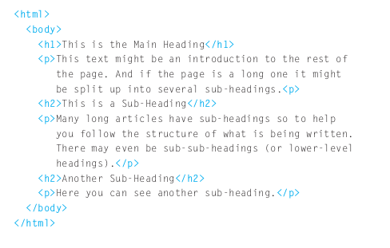

- The **HTML** code (in blue) is made up of characters that live inside angled
brackets — these are called **HTML** elements. Elements are usually
made up of two tags: an **opening tag** and a **closing tag**. (The closing tag
has an extra forward slash in it.) Each **HTML** element tells the browser
something about the information that sits between its opening and
closing tags.

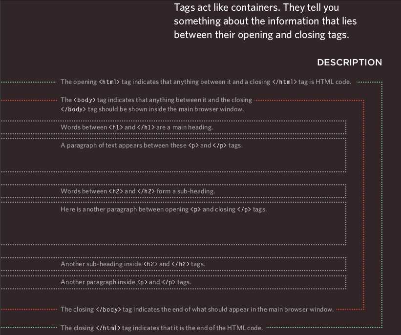

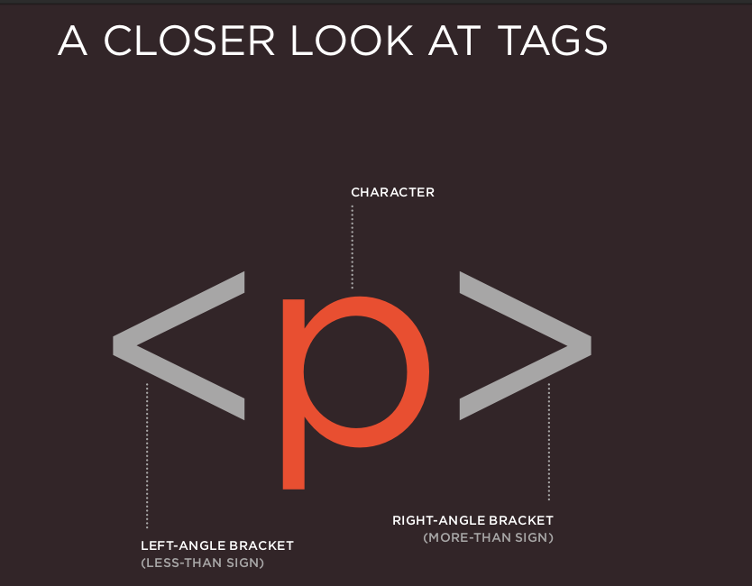

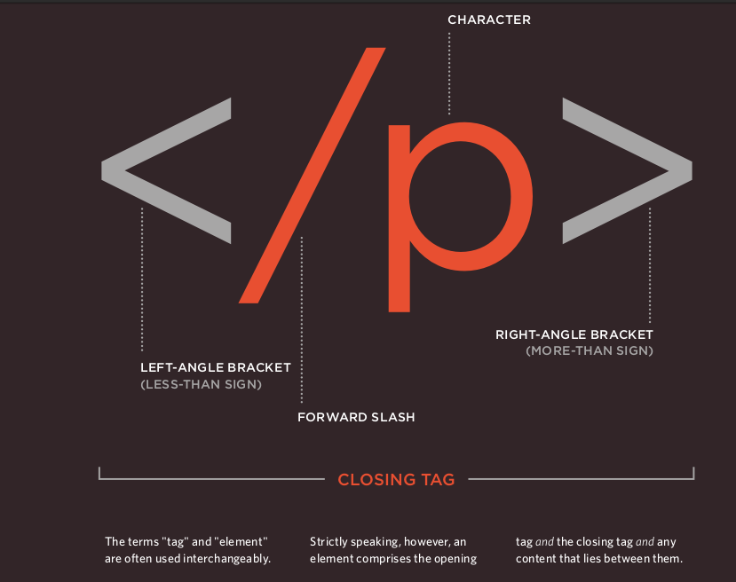

-**Attributes** provide additional information
about the contents of an element. They appear
on the opening tag of the element and are
made up of two parts: a **name** and a **value**,
separated by an equals sign.

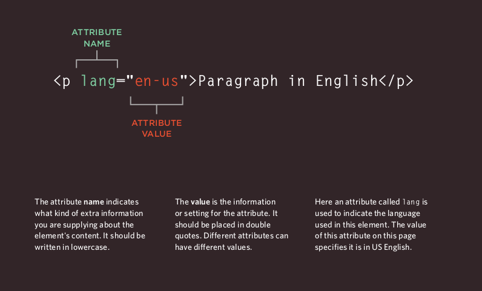

## Body, Head & Title

-      <body> </body>

Everything inside this element is
shown inside the main browser
window.
-      <head> </head>

Before the **body** element you
will often see a **head** element.
This contains information
about the page, you will usually find a **title**
element inside the **head**
element.
-      <title> </title>

The contents of the **title**
element are either shown in the
top of the browser, above where
you usually type in the URL of
the page you want to visit, or
on the tab for that page (if your
browser uses tabs to allow you
to view multiple pages at the
same time).

## **Extra Markup**

## Looking at How Other sites are Built

- When you open a web 
page, you can look for the **View
menu** in your browser, and select
the option that says **Source** or
**View source**.

## DOCTYPEs

Because there have been
several versions of **HTML**, each
web page should begin with a
**DOCTYPE** declaration to tell a
browser which version of **HTML**
the page is using.

- The use of a DOCTYPE
can also help the browser to
render a page correctly.

- **DOCTYPE**  should be
the first thing in a document.
There must be nothing before it,
not even a space.

## IDs And CLASSES

- ## ID ATTRIBUTE

The **id** is used to
uniquely identify that element
from other elements on the
page. Its value should start with
a letter or an underscore (not a
number or any other character).

- It is important that **no two
elements** on the same page
have the same value for their **id**
attributes (otherwise the value is
no longer unique).

- ## CLASS ATTRIBUTE

Every **HTML** element can
also carry a **class** attribute.
Sometimes, rather than uniquely
identifying one element within
a document, you will want a
way to identify several elements
as being different from the
other elements on the page.

- The **class** attribute on any
element can share the same
value.

## THE DIV TAG

     
 

The **div** element allows you to
group a set of elements together
in one block-level box.

- In a browser, the contents of
the **div** element will start on
a new line, but other than this
it will make no difference to the
presentation of the page.

- It can also make it easier to
follow your code if you have used
**div** elements to hold each
section of the page.

## THE META TAG

The **meta** element lives
inside the **head** element and
contains information about that
web page.

- It is not visible to users but
fulfills a number of purposes
such as telling search engines
about your page, who created
it, and whether or not it is time
sensitive. (If the page is time
sensitive, it can be set to expire.)

- The **meta** element is an empty
element so it does not have a
closing tag. It uses attributes to
carry the information.

## HEADER AND FOOTER

The **header** and **footer**
elements can be used for:

1. The main header or footer
that appears at the top or
bottom of every page on the
site.

- A **header** or **footer** for an
individual **article tag** or
**section tag** within the page.

- Each individual **article** and
**section** element can also
have its own **header** and
**footer** elements to hold the
header or footer information for
that section within the page.

## NAV TAG

The **nav** element is used to
contain the major navigational
blocks on the site such as the
primary site navigation.

## **HTML5 Layout**

## Traditional HTML Layouts

-For a long time, web page authors used **div** elements to group
together related elements on the page (such as the elements that form a
header, an article, footer or sidebar). Authors used class or id attributes
to indicate the role of the **div** element in the structure of the page.

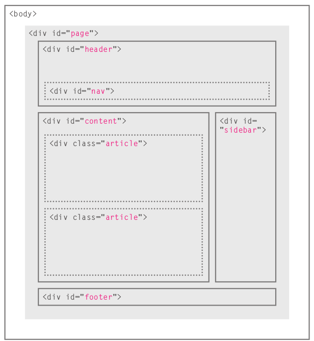

- Lets break down the layout above:

1. At the top of the page is the
header, containing a logo and the
primary navigation.

2. Under this are one or more
articles or posts. Sometimes
these are summaries that link to
individual posts.

3. There is a side bar on the right-
hand side (perhaps featuring
a search option, links to other
recent articles, other sections of
the site, or even ads).

4. When coding a site like this,
developers would usually put
these main sections of the page
inside **div** elements and use
the class or id attributes to
indicate the purpose of that part
of the page.

## New HTML5 Layout

- ***HTML5*** introduces a new set of elements that allow you to divide up the
parts of a page. The names of these elements indicate the kind of content
you will find in them. They are still subject to change, but that has not
stopped many web page authors using them already.
 
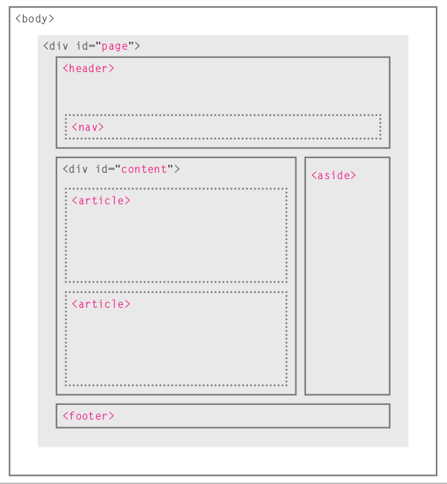

- Lets break down the layout above:

1. This example has exactly the
same structure as seen on the
previous page. However, many
of the **div** elements have been
replaced by new ***HTML5*** layout
elements.

2. For example, the header sits
inside a new ***header*** element,
the navigation in a ***nav***
element, and the articles are in
individual ***article*** elements.

3. The point of creating these
new elements is so that web
page authors can use them to
help describe the structure of
the page. For example, screen
reader software might allow
users to ignore headers and
footers and get straight to
the content. Similarly, search
engines might place more
weight on the content in an
***article*** element than that
in the ***header*** or ***footer***
elements. I think you will agree
that it also makes the code
easier to follow.

### Articles

The ***article*** element acts as
a container for any section of a
page that could stand alone and
potentially be syndicated.

-If a page contains several articles
(or even summaries of several
articles), then each individual
article would live inside its own
***article*** element. The ***article*** elements can
even be nested inside each
other.

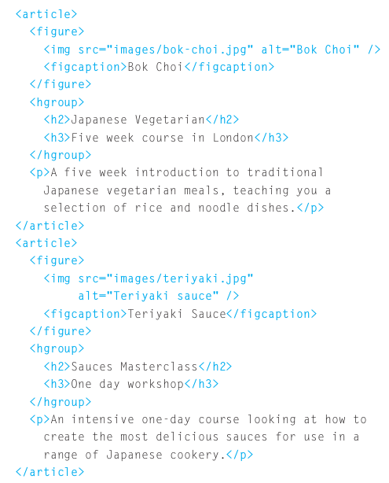

# Process and Design

## Who is the Site For?

Every website should be designed for the
target audience—not just for yourself or the
site owner. It is therefore very important to
understand who your target audience is.

### **Target Audience: individuals:**

- What is the age range of your target audience?

- Will your site appeal to more women or men? What is the mix?

- Which country do your visitors live in?

- Do they live in urban or rural areas.

- What is the average income of visitors?

- What level of education do they have?

- What is their marital or family status?

- What is their occupation?

- How many hours do they work per week?

- How often do they use the web?

- What kind of device do they use to access the web?

### **Target Audience: Companies:**

- What is the size of the company or relevant department?

- What is the position of people in the company who visit your site?

- Will visitors be using the site for themselves or for someone else?

- How large is the budget they control?

## What Information Your Visitors Need?

You need to work out what information the visitors need in order to achieve their goals quickly and effectively.

## **Key Information:**

- Will visitors be familiar with
your subject area / brand
or do you need to introduce
yourself?

- Will they be familiar with
the product / service /
information you are covering
or do they need background
information on it?

- What are the most important
features of what you are
offering?

- What is special about what
you offer that differentiates
you from other sites that offer
something similar?

- Once people have achieved
the goal that sent them to
your site, are there common
questions people ask about
this subject area?

## Site Maps

- The aim is to create a diagram
of the pages that will be used
to structure the site. This is
known as a **site map** and it will
show how those pages can be
grouped.

 - You can use something called **card sorting** to help you decide what
information should go on each
page.

- A site map will usually
begin with the homepage.

- Remember to focus on the
goals that your visitors want to
achieve.

## **Example 1:**

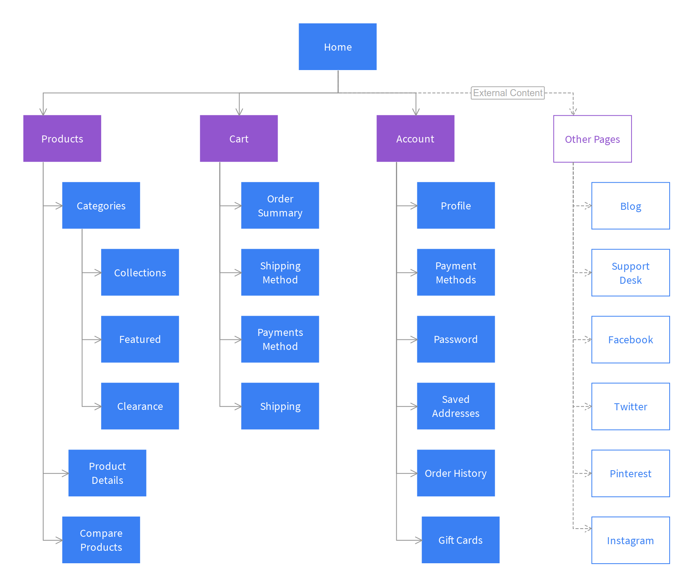

# **Example 2:**

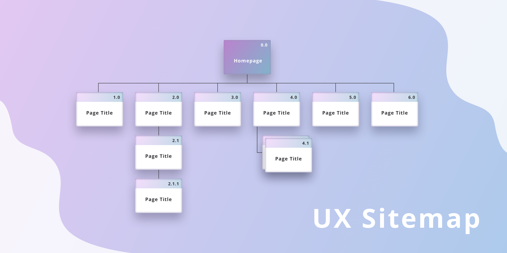

## Wireframes

- A **wireframe** is a simple sketch of the key
information that needs to go on each page of a
site. It shows the hierarchy of the information
and how much space it might require.

- A lot of designers will take the
elements that need to appear on
each page and start by creating
wireframes. This involves
sketching or shading areas
where each element of the page
will go.

- By creating a wireframe you can
ensure that all of the information
that needs to be on a page is
included.

- You should **not** include the
color scheme, font choices,
backgrounds or images for
the website in the wireframe.
It should focus on what
information needs to be on
each page and create a visual
hierarchy to indicate the most
important parts of each page.

- The wireframes make design
easier because you know what
information needs to appear on
which page before considering how the the page should look.

# **Example 1:**

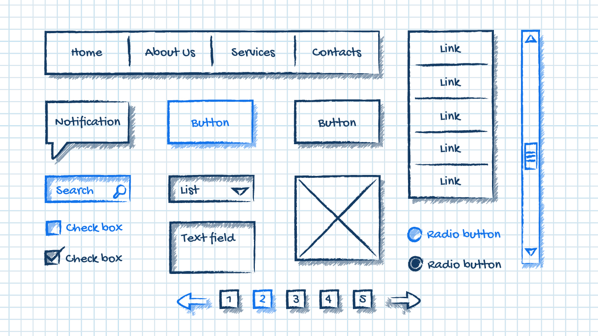

# **Example 2:**

## Visual hierarchy

Most web users do not read entire pages. Rather, they skim to find
information. You can use contrast to create a **visual hierarchy** that gets
across your key message and helps users find what they are looking for.

### **Visual hierarchy:** 
It's the order in which your eyes perceive what
they see. It is created by adding visual contrast between the items being
displayed. Items with higher contrast are recognized and processed first.

- ***Size***

Larger elements will grab users'
attention first. For this reason it
is a good idea to make headings
and key points relatively large.

- ***Color***

Foreground and background
color can draw attention to key
messages. Brighter sections tend
to draw users' attention first.

- ***Style***

An element may be the same
size and color as surrounding
content but have a different style
applied to it to make it stand out.

- The effect of a well-designed
**visual hierarchy** is largely
subliminal. Achieving a good
hierarchy requires balance; if
nothing stands out a site can be
rather uninteresting, and if too
many aspects are competing
for your attention it can be hard
to find the key messages.

## Designing Navigation

Site navigation not only helps people find where they want to go, but also
helps them understand what your site is about and how it is organized.
Good navigation tends to follow these principles:

- **Concise**

The navigation should
be quick and easy to read. It is
a good idea to try to limit the
number of options in a menu to
no more than **eight** links. These
can link to section homepages
which in turn link to other pages.

- **Clear**

Users should be able to predict
the kind of information that
they will find on the page
before clicking on the link.
Where possible, choose single
descriptive words for each link
rather than phrases.

- **Selective**

The primary navigation should
only reflect the sections or
content of the site. Functions
like logins and search, and legal
information like terms and
conditions and so on are best
placed elsewhere on the page.

- **Context**

Good navigation provides
context. It lets the user know
where they are in the website at
that moment. Using a **different
color** or some kind of visual
marker to indicate the current
page is a good way to do this.

- **Interactive**

Each link should be big enough
to click on and the appearance
of the link should change when
the user hovers over each item
or clicks on it. It should also
be **visually distinct** from other
content on the page.

- **Consistent**

The more pages a site contains,
the larger the number of
navigation items there will be.
Although secondary navigation
will change from page to page,
it is best to keep the primary
navigation exactly the same.

 
# JavaScript

## What is JavaScript?

**JavaScript** is a scripting or programming language that allows you to implement complex features on web pages, every time a web page does more than just sit there and display static information for you to look at displaying timely content updates, interactive maps, animated 2D/3D graphics, scrolling video jukeboxes, etc. you can bet that **JavaScript** is probably involved. It is the third layer of the layer cake of standard web technologies, two of which (**HTML** and **CSS**).

## Examples of JavaScript is the browser:

1. Slideshows.
2. Forms.
3. Reload part of page.
4. Filtering data.

## The ABC of programing

### Scripts

-A ***script*** is a series of instructions that a
computer can follow to achieve a goal.
You could compare scripts to any of the following:

1. Recipes.
2. Handbooks.
3. Manuals.

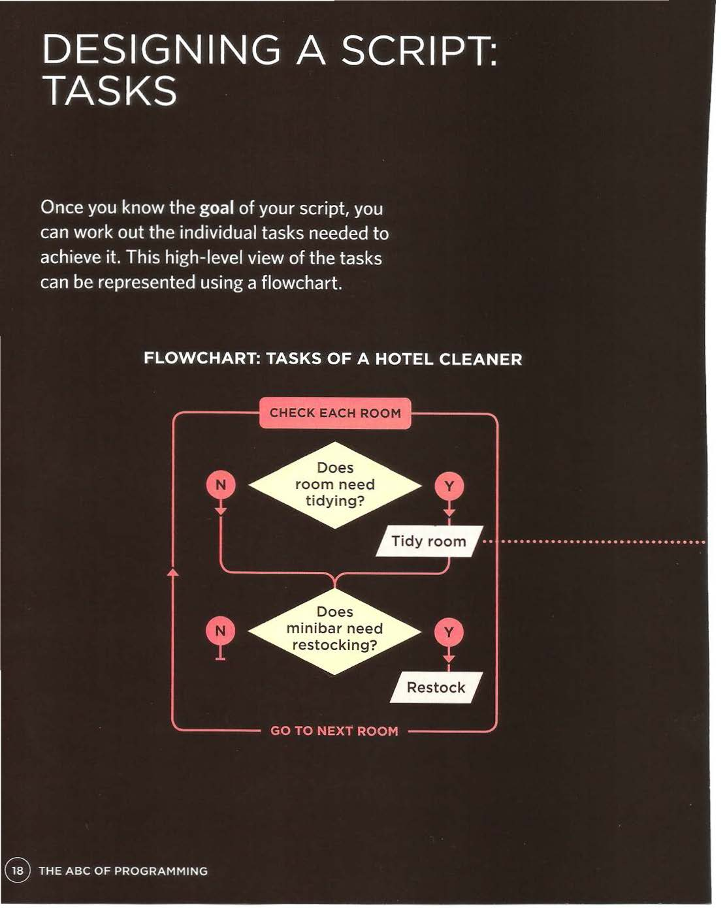
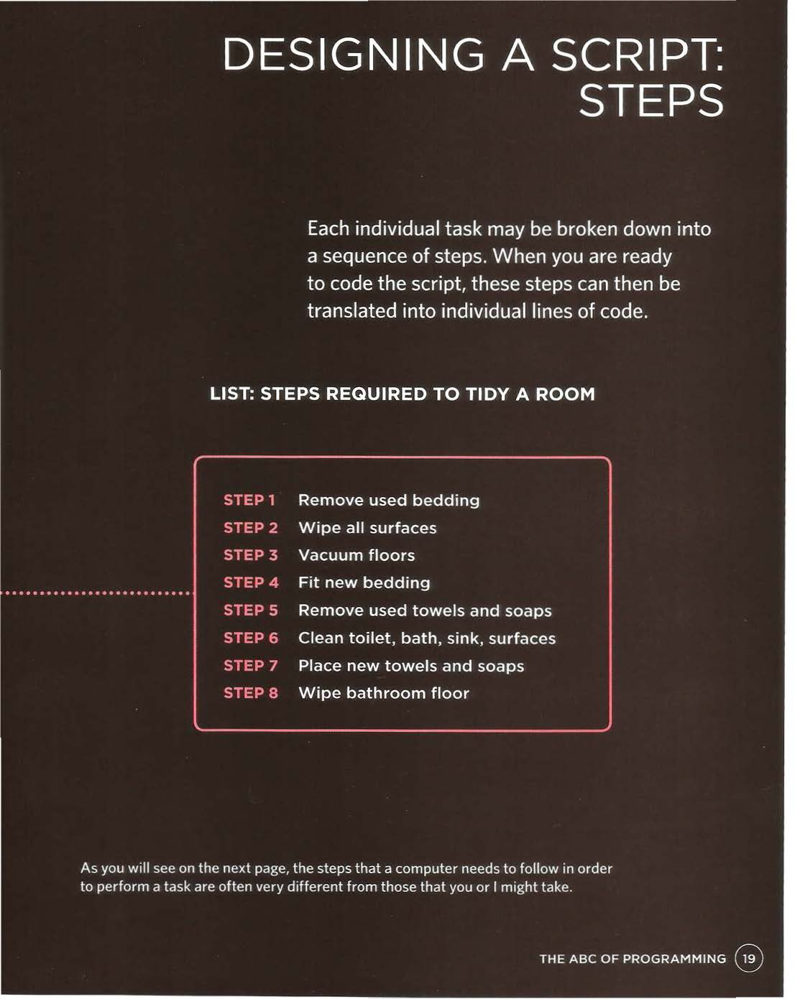

-Often scripts will need to perform different tasks in different situations.
You can use flowcharts to work out how the tasks fit together.
The flowcharts show the paths between each step.

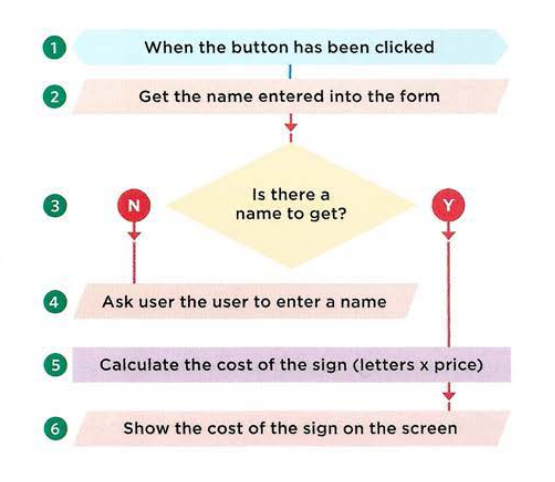

**References:**

- HTML & CSS Design and Build Websites
by Jon Duckett [Get the book](https://www.amazon.com/HTML-CSS-Design-Build-Websites/dp/1118008189)

- JavaScript and JQuery: Interactive Front-End Web Development
by Jon Duckett [Get the book](https://www.amazon.com/JavaScript-JQuery-Interactive-Front-End-Development/dp/1118531647)

## [Main page](https://amjadmesmar.github.io/reading-notes/)