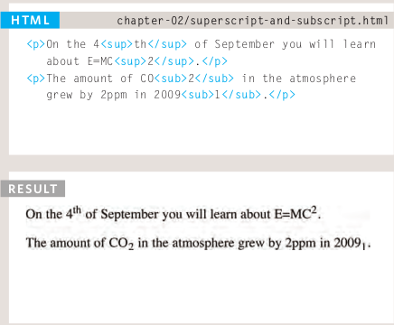
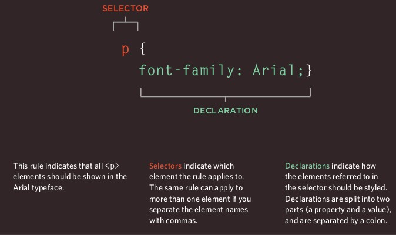
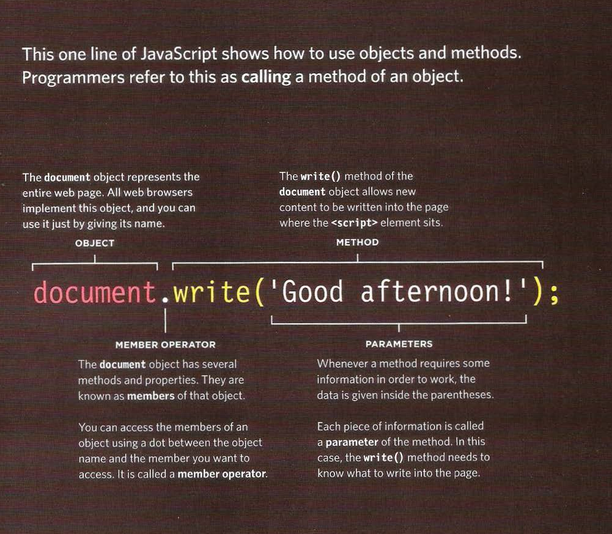
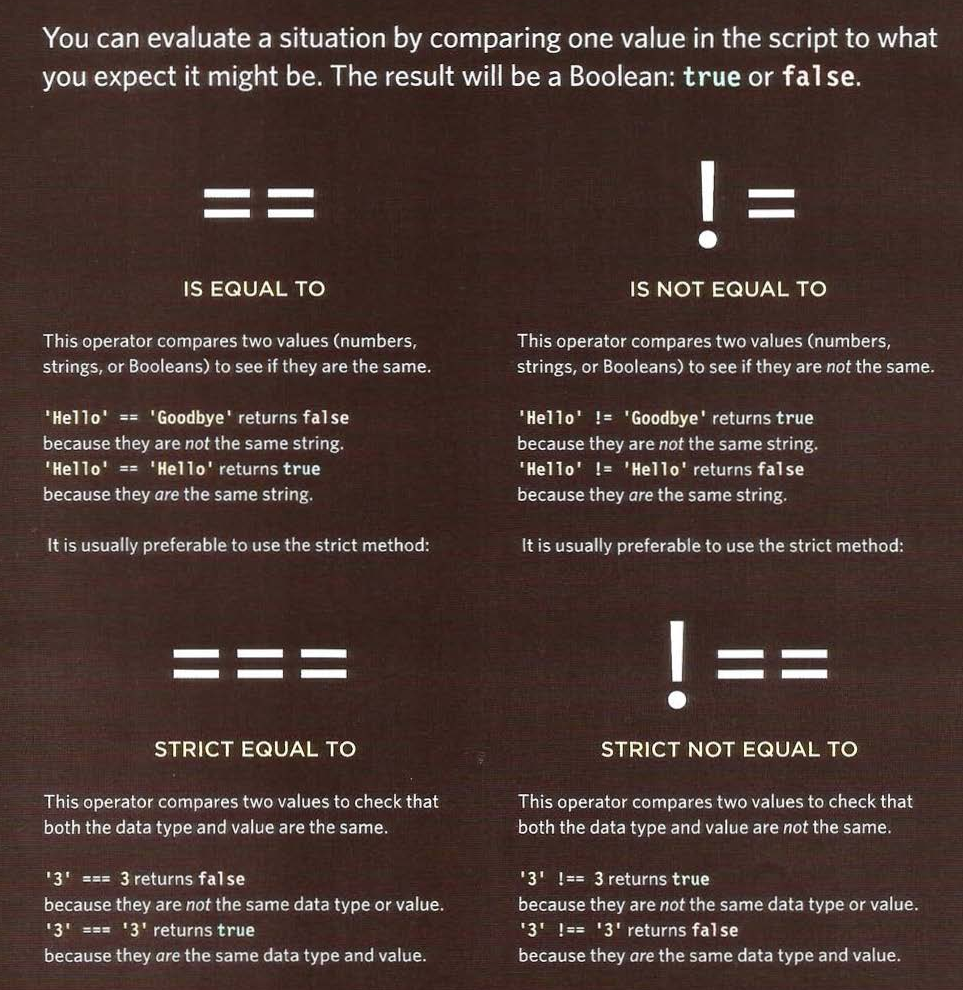
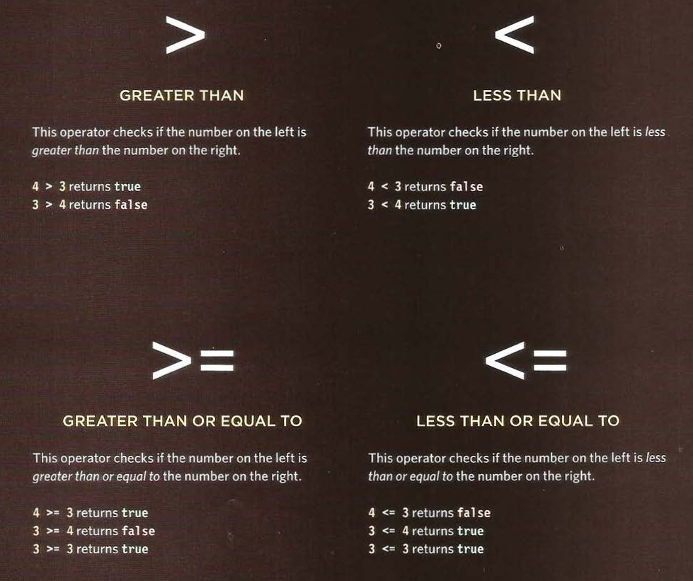
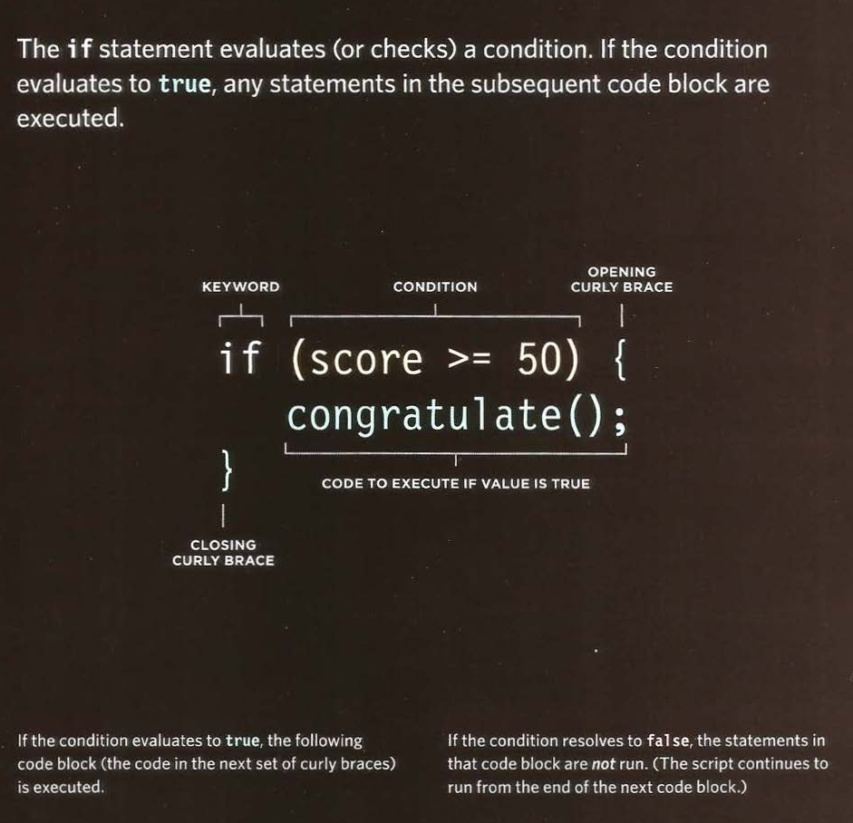
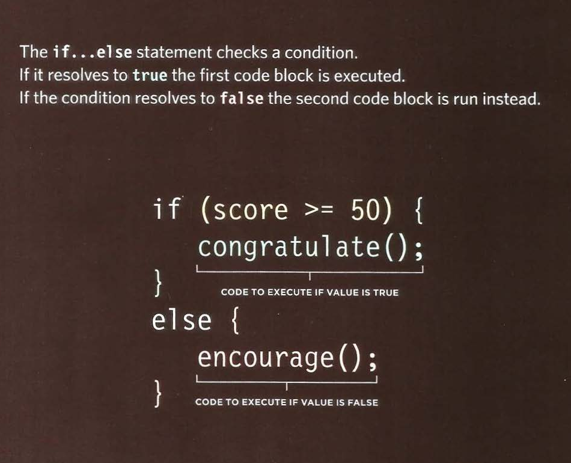
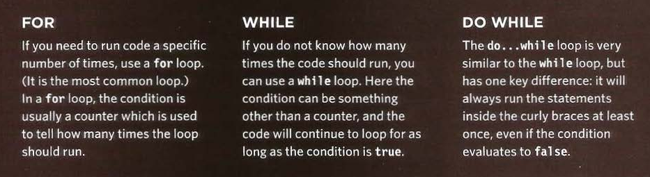
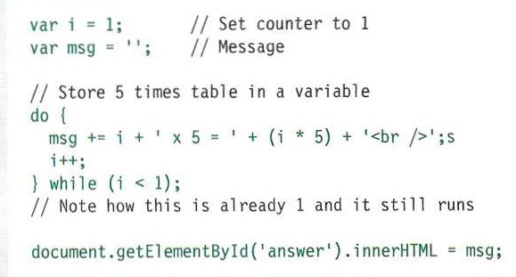

# HTML Text

## Headings

- **HTML** has six "levels" of
headings (from ***h1*** to ***h6**):

## Paragraphs

- To create a paragraph, surround
the words that make up the
paragraph with an opening ***p***
tag and closing ***p*** tag.

- By default, a browser will show
each paragraph on a new line
with some space between it and
any subsequent paragraphs.

## Bold & Italic

1. ### Bold:

- The ***b*** element also represents
a section of text that would be
presented in a visually different
way (for example key words in a
paragraph) although the use of
the ***b*** element does not imply
any additional meaning.

- By enclosing words in the tags
***b*** and ***b*** we can make
characters appear bold.

### ***Example:***

    
This is how we make a word appear <b>bold.</b>
    

    
Inside a product description you might see some
    <b>key features</b> in bold.

2. ### Italic:

- The ***i*** element also represents
a section of text that would be
said in a different way from
surrounding content — such as
technical terms, names of ships,
foreign words, thoughts, or other
terms that would usually be
italicized.

- By enclosing words in the tags
***i*** and ***i*** we can make
characters appear italic.

### ***Example:***

    
This is how we make a word appear <i>italic</i>.
    

    
It's a potato <i>Solanum teberosum</i>.

    
Captain Cook sailed to Australia on the
    <i>Endeavour</i>.

## Superscript & Subscript

- The ***sup*** element is used
to contain characters that
should be superscript such
as the suffixes of dates or
mathematical concepts like
raising a number to a power such
as 2 2 .

- The ***sub*** element is used to
contain characters that should
be subscript. It is commonly
used with foot notes or chemical
formulas such as H 2 0.

### ***Example:***

## Line Breaks & Horizontal Rules

1. ### Line breaks:

- As you have already seen, the
browser will automatically show
each new paragraph or heading
on a new line. But if you wanted
to add a line break inside the
middle of a paragraph you can
use the line break tag ***br***.

### ***Example:***

      
The Earth gets one hundred tons heavier
      every day due to falling space dust.

2. ### Horizontal Rules:

- To create a break between
themes — such as a change of
topic in a book or a new scene
in a play — you can add a
horizontal rule between sections
using the ***hr*** tag.

### ***Example:***

    
Venus is the only planet that rotates
    clockwise.

    

    
Jupiter is bigger than all the other planets
    combined.

# Introduction to CSS:

## Whats is CSS?

- **CSS** Stands for "***Cascading Style Sheet***." Cascading style sheets are used to format the layout of Web pages. They can be used to define text styles, table sizes, and other aspects of Web pages that previously could only be defined in a page's **HTML**.

- **CSS** allows you to create rules that specify how the content of
an element should appear. For example, you can specify that
the background of the page is cream, all paragraphs should
appear in gray using the Arial typeface, or that all level one
headings should be in a blue, italic, Times typeface.

- **CSS** works by associating rules with **HTML** elements. These rules govern
how the content of specified elements should be displayed.

- A **CSS** rule contains two parts: 
1. A **selector**.
2. A **declaration**.

- **CSS** declarations sit inside curly brackets and each is made up of two
parts: a property and a value, separated by a colon. You can specify
several properties in one declaration, each separated by a semi-colon.

## Using External CSS

## link 

- The **link** element can be used
in an **HTML** document to tell the
browser where to find the **CSS**
file used to style the page. It is an
empty element (meaning it does
not need a closing tag), and it
lives inside the **head** element.

- It should use three attributes:

1. ## ***href***

This specifies the path to the
**CSS** file (which is often placed in
a folder called css or styles).

2. ## ***type***

This attribute specifies the type
of document being linked to. The
value should be **text/css**.

3. ## ***rel***

This specifies the relationship
between the **HTML** page and
the file it is linked to. The value
should be stylesheet when
linking to a **CSS** file.

- An **HTML** page can use more
than one **CSS** style sheet.

## CSS Selectors

- There are many different types
of **CSS** selector that allow you to
target rules to specific elements
in an HTML document:

# Basic JavaScript Instructions

## How to use objects and methods

- When the browser comes across a ***script*** element, it stops to load the script and then checks to see if it needs to do anything.

## Decisions And Loops

# Comparison Operators

## Evaluating Conditions:

## Using comparision operators:

### **Example:**

    var pass = 50;  // Pass mark
    var score = 90; //Score

    // Check if the user has passed
    var hasPassed = score > = pass ;

    // Write the message into the page
    var el = document.getElementByl('answer');
    e1.textContent = 'Leve 1 passed: ' + hasPassed;

## If Statment

## If Else Statment

# Loops :

- **Loops** check a condition. If it returns **true**,a code block will run.
Then the condition will be checked again and if it still returns **true**, the code block will run again. it repeats until the condition returns 2**false**.

- There are 3 common tyoes of loops :

## Loop counters and For Loops:

## Using While loops:

### **Example:**

## Using Do While loops:

### **Example:**

**References:**

- HTML & CSS Design and Build Websites
by Jon Duckett [Get the book](https://www.amazon.com/HTML-CSS-Design-Build-Websites/dp/1118008189)

- JavaScript and JQuery: Interactive Front-End Web Development
by Jon Duckett [Get the book](https://www.amazon.com/JavaScript-JQuery-Interactive-Front-End-Development/dp/1118531647)

## [Main page](https://amjadmesmar.github.io/reading-notes/)