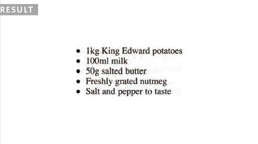

# HTML

## Chapter 3: Lists

- **HTML** provides us with three different types of lists:

1. ***Ordered lists*** are lists where each item in the list is
numbered. For example, the list might be a set of steps for
a recipe that must be performed in order, or a legal contract
where each point needs to be identified by a section
number.

2. ***Unordered lists*** are lists that begin with a bullet point
(rather than characters that indicate order).

3. ***Definition lists*** are made up of a set of terms along with the
definitions for each of those terms.

### Ordered Lists

- The ***ordered list*** is created with
the **ol** element.

- Each item in the list is placed
between an opening **li** tag
and a closing **li** tag. (The li
stands for ***list item***.)

### ***Ordered List Example:***

    <ol>
    <li>Chop potatoes into quarters</li>
    <li>Simmer in salted water for 15-20 minutes until tender</li>
    <li>Heat milk, butter and nutmeg</li>
    <li>Drain potatoes and mash</li>
    <li>Mix in the milk mixture</li>
    </ol>

### Unordered Lists

- ***The unordered*** list is created
with the **ul** element.

- Each item in the list is placed
between an opening **li** tag
and a closing **li** tag. (The li
stands for ***list item***.)

### ***Unordered List Example:***

    <ul>
    <li>1kg King Edward potatoes</li>
    <li>100ml milk</li>
    <li>50g salted butter</li>
    <li>Freshly grated nutmeg</li>
    <li>Salt and pepper to taste</li>
    </ul>

### Definition Lists

**References:**

- The ***definition list*** is created with
the **dl** element and usually
consists of a series of terms and
their definitions.
Inside the **dl** element you will
usually see pairs of **dt** and
**dd** elements.

- **dt tag:** This is used to contain the term
being defined (the definition
term).

- **dd tag:** This is used to contain the
definition.
Sometimes you might see a list
where there are two terms used
for the same definition or two
different definitions for the same
term.

### ***Definition List Example:***

    <dl>
    <dt>Sashimi</dt>
    <dd>Sliced raw fish that is served with condiments such as shredded daikon radish or ginger root, wasabi and soy sauce</dd>
    <dt>Scale</dt>
    <dd>A device used to accurately measure the weight of ingredients</dd>
    <dd>A technique by which the scales are removed from the skin of a fish</dd>
    <dt>Scamorze</dt>
    <dt>Scamorzo</dt>
    <dd>An Italian cheese usually made from whole cow's milk (although it was traditionally made from buffalo milk)</dd>
    </dl>

## Chapter 13: Boxes

## Box Dimensions (width, height)

- By default a box is sized just big
enough to hold its contents. To
set your own dimensions for a
box you can use the ***height*** and
***width*** properties.

- The most popular ways to
specify the size of a box are
to use ***pixels***, ***percentages***, or
***ems***. Traditionally, ***pixels*** have
been the most popular method
because they allow designers to
accurately control their size.

- When you use ***percentages***,
the size of the box is relative to
the size of the browser window
or, if the box is encased within
another box, it is a percentage of
the size of the containing box.

- When you use ***ems***, the size
of the box is based on the size
of text within it. Designers
have recently started to use
***percentages*** and ***ems*** more for
measurements as they try to
create designs that are flexible
across devices which have
different-sized screens.

### ***Example:***

## Limiting width and height

1. ### ***width:***

- Some page designs expand and
shrink to fit the size of the user's
screen. In such designs, the
min-width property specifies
the smallest size a box can be
displayed at when the browser
window is narrow, and the
***max-width*** property indicates
the maximum width a box can
stretch to when the browser
window is wide.

- These are very helpful properties
to ensure that the content of
pages are legible (especially on
the smaller screens of handheld
devices).

- For example, you can
use the ***max-width*** property to
ensure that lines of text do not
appear too wide within a big
browser window and you can
use the ***min-width*** property
to make sure that they do not
appear too narrow.

### ***Width Example:***

2. ### ***height:***

- In the same way that you might
want to limit the ***width*** of a box
on a page, you may also want
to limit the ***height*** of it. This is
achieved using the min-height
and ***max-height*** properties.

- If the box is not big enough to
hold the content, and the content
expands outside the box it can
look very messy. To control
what happens when there is not
enough space for the content of
a box, you can use the ***overflow***
property, which is discussed on
the next page.

### ***Height Example:***

## Overflowing Content

### ***overflow:***

The ***overflow property*** tells the
browser what to do if the content
contained within a box is larger
than the box itself. It can have
one of two values:

1. ***hidden:***

This property simply hides any
extra content that does not fit in
the box.

2. ***scroll***

This property adds a scrollbar to
the box so that users can scroll
to see the missing content.
This property simply hides any
extra content that does not fit in
the box.

### ***Overflow Example:***

## Border, Margin & Padding

- Every box has three available properties that
can be adjusted to control its appearance:

## White space & Vertical Margin

- The padding and margin properties are very helpful in adding space between various items on the page.

- Designers refer to the space
between items on a page as
white space. Imagine you had
a border around a box. You
would not want the text to touch
this border or it would become
harder to read.

**References:**

- HTML & CSS Design and Build Websites
by Jon Duckett [Get the book](https://www.amazon.com/HTML-CSS-Design-Build-Websites/dp/1118008189)

- JavaScript and JQuery: Interactive Front-End Web Development
by Jon Duckett [Get the book](https://www.amazon.com/JavaScript-JQuery-Interactive-Front-End-Development/dp/1118531647)

## [Main page](https://amjadmesmar.github.io/reading-notes/)
