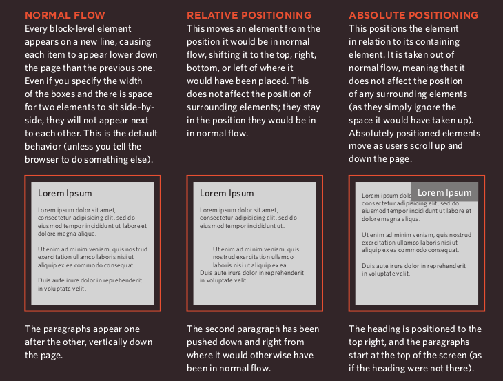
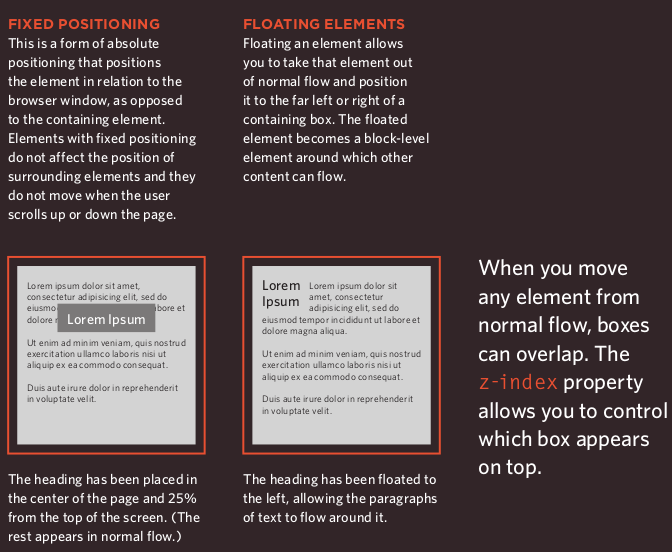
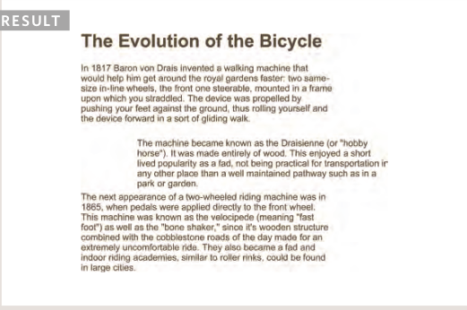
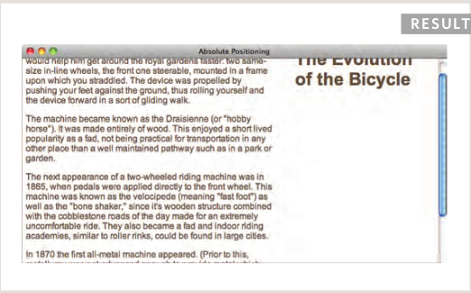
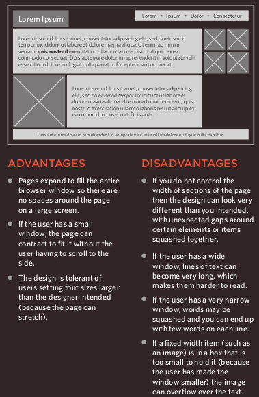
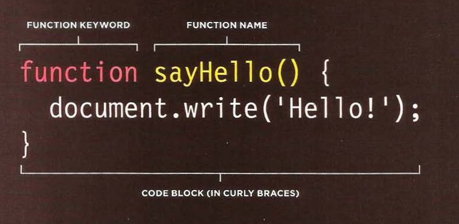

# HTML

## Chapter 4: Links

- ***Links*** are the defining feature of the web because they allow you to move from one web page to another — enabling the very idea of browsing or surfing.

- Links are created using the **a** element. Users can click on anything between the opening **a** tag and the closing **a** tag.You specify which page you want to link to using the href attribute.

***Result:***

## Linking to Other Sites

- Links are created using the <***a***>
element which has an attribute
called href . The value of the
href attribute is the page that
you want people to go to when
they click on the link.

- Users can click on anything that
appears between the opening
<***a***> tag and the closing </***a***>
tag and will be taken to the page
specified in the href attribute.

- When you link to a different
website, the value of the ***href***
attribute will be the full web
address for the site, which is
known as an **absolute URL**.

***Example:***

    
Movie Reviews:
    <ul>
    <li><a href="http://www.empireonline.com">
     Empire</a></li>
     
    <li><a href="http://www.metacritic.com">
    Metacritic</a></li>

    <li><a href="http://www.rottentomatoes.com">
    Rotten Tomatoes</a></li>

    <li><a href="http://www.variety.com">
    Variety</a></li>

    </ul>
    

## Opening Links in a New Window

- If you want a link to open in a new window, you can use the target attribute on the opening <***a***> tag. The value of this attribute should be _blank .

- One of the most common reasons a web page author might want a link to be opened in a new window is if it points to another website. In such cases, they hope the user will return to the window containing their site after finishing looking at the other one.

- Generally you should avoid opening links in a new window, but if you do, it is considered good practice to inform users that the link will open a new window before they click on it.

## CSS

## Chapter 15: Layouts

## Controlling the Position of Elements

- ***CSS*** has the following positioning schemes that allow you to control the layout of a page: **normal flow**, **relative positioning**, and **absolute positioning**. You specify the positioning scheme using the position property in ***CSS***. You can also float elements using the float property.

- To indicate where a box should be positioned, you may also need to use box offset properties to tell the browser how far from the top or bottom and left or right it should be placed. (You will meet these when we introduce the positioning schemes on the following pages.)

## Normal Flow

***position:static***

- In ***normal flow***, each block-level
element sits on top of the next
one. Since this is the default
way in which browsers treat
***HTML*** elements, you do not
need a ***CSS*** property to indicate
that elements should appear
in normal flow, but the syntax
would be.

## Relative positioning

***position:relative***

- ***Relative positioning*** moves an element in relation to where it would have been in ***normal flow***.

-You can indicate that an element should be relatively positioned using the position property with a value of relative.

***Example:***

## Absolute Positioning

***position:absolute***

- When the position property is given a value of absolute , the box is taken out of normal flow and no longer affects the position of other elements on the page. (They act like it is not there.)

- The box offset properties (***top*** or ***bottom*** and ***left*** or ***right***) specify where the element should appear in relation to its containing element.

***Example:***

## Fixed Width Layouts

- Fixed width layout designs do not change size as the user increases or decreases the size of their browser window. Measurements tend to be given in pixels.

## Liquid Layouts

- Liquid layout designs stretch and contract as the user increases or decreases the size of their browser window. They tend to use percentages.

- Because liquid layouts can stretch the entire width of the browser, resulting in long lines of text that are hard to read, some liquid layouts only let part of the page expand and contract. Other parts of the page have minimum and maximum widths.

## JavaScript

## Chapter 3: Functions, Methods, and Objects

## Functions

## What is a function?

- **Functions** let you group a series of statements together to perform a
specific task.

- ## **Function declaration:**

- ## **Calling a function:**

- ## **Declaring functions that needs information**

## Article Summary: Pair Programming

### What is pair programming?

- Pair programming is the practice of two developers sharing a single workstation to interactively tackle a coding task together.

### How does pair programming work?

- pair programming commonly involves two roles: the ***Driver*** and the ***Navigator***.

1. ***The Driver*** is the programmer who is typing and the only one whose hands are on the keyboard.

2. ***The Navigator*** uses their words to guide the Driver but does not provide any direct input to the computer.

## Why pair program?

1. ***Greater efficiency:***
When two people focus on the same code base, it is easier to catch mistakes in the making.

2. ***Engaged collaboration:***
When developers pair program, they rely more on each other and can often find a solution together without needing to ask for additional help. Ultimately, this boosts overall confidence.

3. **Learning from fellow students:** 
Working with a teammate can expose developers to techniques they otherwise would not have thought of. If one developer has a unique approach to a specific problem, pair programming exposes the other developer to a new solution.

4. ***Social skills:***
Pair programming not only improves programming skills, but can also help programmers develop their interpersonal skills. When just grabbing the keyboard and taking over isn’t an option, getting good at finding the right words is a skill unto itself.

5. ***Job interview readiness:***
By pair programming between a current employee and an applicant, companies can get a better feel for how an applicant will fit into the team and their collaboration style.

6. ***Work environment readiness:***
Many companies that utilize pair programing expect to train fresh hires from CS-degree programs on how they operate to actually deliver a product.

**References:**

- HTML & CSS Design and Build Websites
by Jon Duckett [Get the book](https://www.amazon.com/HTML-CSS-Design-Build-Websites/dp/1118008189)

- JavaScript and JQuery: Interactive Front-End Web Development
by Jon Duckett [Get the book](https://www.amazon.com/JavaScript-JQuery-Interactive-Front-End-Development/dp/1118531647)

- 6 Reasons for Pair Programming [Read the full article here](https://www.codefellows.org/blog/6-reasons-for-pair-programming/)

## [Main page](https://amjadmesmar.github.io/reading-notes/)
