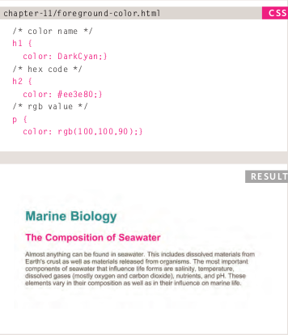
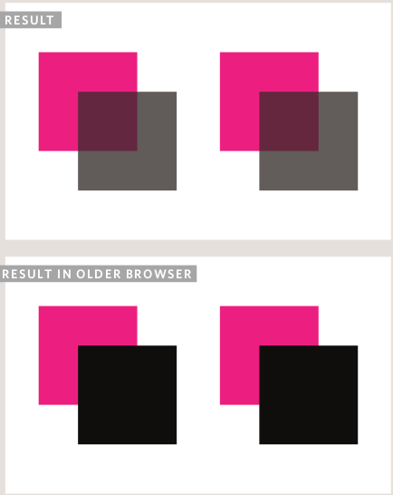
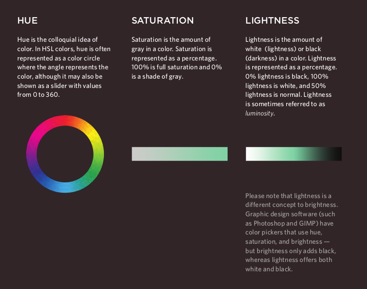

# HTML & CSS

## Chapter 5: Images

- There are many reasons why you might want to add an image to a web page: you might want to include a logo, photograph, illustration, diagram, or chart.

## Adding Images

- <***img***>

To add an image into the page
you need to use an <***img***>
element. This is an empty
element (which means there is
no closing tag). It must carry the
following two attributes:

1. ***src:***
This tells the browser where
it can find the image file. This
will usually be a relative ***URL***
pointing to an image on your
own site.

2. ***alt:***
This provides a text description
of the image which describes the
image if you cannot see it.

3. ***title:***
You can also use the title
attribute with the <***img***> element
to provide additional information
about the image. Most browsers
will display the content of this
attribute in a tootip when the
user hovers over the image.

## Where to Place Image in Your Code

1. ***Before a paragraph:***
The paragraph starts on a new
line after the image.

2. ***Inside the start of a paragraph:***
The first row of text aligns with the bottom of the image.

3. ***In the middle of a paragraph:***
The image is placed between the words of the paragraph that it appears in.

***Example:***

## Old Code: Aligning Images Horizontally

1. ***left:***
This aligns the image to the left
(allowing text to flow around its
right-hand side).

2. ***right:***
This aligns the image to the right
(allowing text to flow around its
left-hand side).

## Old Code: Aligning Images Vertically

1. ***top:***
This aligns the first line of the
surrounding text with the top of
the image.

2. ***middle:***
This aligns the first line of the
surrounding text with the middle
of the image.

3. ***bottom:***
This aligns the first line of the
surrounding text with the bottom
of the image.

## Cropping Images

- When cropping images it is important not to lose valuable information. It is best to source images that are the correct shape if possible.

## Image Resolution

- Images created for the web should be saved at a resolution of 72 ***ppi***. The higher the resolution of the image, the larger the size of the file.

- ***PGs***, ***GIFs***, and ***PNGs*** belong to a type of image format known as ***bitmap***. They are made up of lots of miniature squares. The resolution of an image is the number of squares that fit within a 1 inch x 1 inch square area.

- Images appearing on computer screens are made of tiny squares called ***pixels***. The web browsers on most desktop computers display images at a resolution of 72 ***pixels per inch*** (***ppi***). Images in print materials (such as books and magazines) are made up of tiny circles called ***dots***. These images are usually
printed at a resolution of 300 ***dots per inch*** (***dpi***).

## Vector Images

- ***Vector*** images differ from ***bitmap*** images and
are resolution-independent. Vector images are
commonly created in programs such as ***Adobe Illustrator***.

When an image is a line drawing
(such as a logo, illustration, or
diagram), designers will often
create it in vector format.

Vector formatted images are
very different to bitmap images.
Vector images are created by
placing points on a grid, and
drawing lines between those
points. A color can then be
added to "fill in" the lines that
have been created.

The advantage of creating line
drawings in vector format is that
you can increase the dimensions
of the image without affecting
the quality of it.

## Animated GIFs

- Animated ***GIFs*** show several frames of an image in sequence and therefore can be used to create simple animations.

- Because ***GIFs*** are not an ideal format for displaying photographs, animated ***GIFs*** are really only suitable for simple illustrations.

- Some designers frown on animated ***GIFs*** because they remember a lot of amateur web designers overusing them in the 1990's.

## Chapter 11: Color

- The color property allows you
to specify the color of text inside
an element. You can specify any
color in CSS in one of three ways:

- ***RGB values:***
These express colors in terms of how much red, green and blue are used to make it up. For ***example:*** rgb(100,100,90)

- ***Hex code:***
These are six-digit codes that represent the amount of red, green and blue in a color, preceded by a pound or hash # sign. For ***example:*** #ee3e80.

- ***Color names:***
There are 147 predefined color names that are recognized by browsers. For ***example:*** DarkCyan.

## Understanding Color

Every color on a computer screen is created by mixing amounts of red,
green, and blue. To find the color you want, you can use a color picker.

## Contrast

When picking foreground and background colors, it is important to ensure that there is enough contrast for the text to be legible.

# Opacity

***Example:***

    p.one {
    background-color: rgb(0,0,0);
    opacity: 0.5;}
    p.two {
    background-color: rgb(0,0,0);
    background-color: rgba(0,0,0,0.5);}

## HSL Colors

CSS3 introduces an entirely new and intuitive way to specify colors using hue, saturation, and lightness values.

## Chapter 12: Text

The properties that allow you to control the appearance of text can be split into two groups:

1. Those that directly affect the font and its appearance (including the typeface, whether it is regular, bold or italic, and the size of the text).

2. Those that would have the same effect on text no matter what font you were using (including the color of text and the spacing between words and letters).

- The formatting of your text can have a significant effect on how readable your pages are. As we look through these properties I will also give you some design tips on how to display your type.

## Specifying Typefaces
***font-family***

- The font-family property allows you to specify the typeface that should be used for any text inside the element(s) to which a CSS rule applies.

- The value of this property is the name of the typeface you want to use.

## Units of Type Size

## UpperCase & LowerCase
***text-transform***

- The text-transform property is used to change the case of text giving it one of the following values:

1. ***uppercase:***This causes the text to appear uppercase.

2. ***lowercase:*** This causes the text to appear lowercase.

3. ***capitalize***: This causes the first letter of each word to appear capitalized.

## Attribute Selectors

## Article Summary: JPEG vs PNG vs GIF — which image format to use and when?

### When to use each image format?

1. Use ***JPEG*** format for all images that contain a natural scene or photograph where variation in colour and intensity is smooth.
2. Use ***PNG*** format for any image that needs transparency or for images with text & objects with sharp contrast edges like logos.
3. Use ***GIF*** format for images that contain animations.

### Compression

- Compression can be of two types:

 1. lossless, like ***PNG*** and ***GIF***.
 2. lossy, like ***JPEG***.

### Transparency

In a simple form, transparency indicates something that is completely invisible. Logos and icons often need to be placed on backgrounds with variable colours. Hence it is desirable, that the background of these logos and icons is made transparent so that a single image can be used over multiple background variations.

 1. ***JPEG*** images don’t support transparency and are hence not usable for such cases.

 2. ***PNG*** images support transparency.

 3. ***GIF*** images support transparency by declaring a single colour in the colour palette as transparent (index transparency).

 

**References:**

- HTML & CSS Design and Build Websites
by Jon Duckett [Get the book](https://www.amazon.com/HTML-CSS-Design-Build-Websites/dp/1118008189)

- JPEG vs PNG vs GIF [Read the full article here](https://blog.imagekit.io/jpeg-vs-png-vs-gif-which-image-format-to-use-and-when-c8913ae3e01d)

## [Main page](https://amjadmesmar.github.io/reading-notes/)
