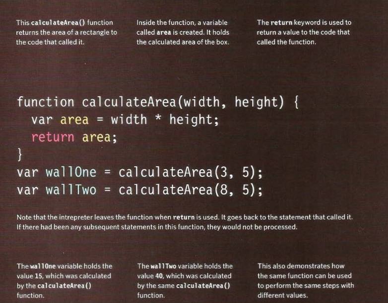

# JavaScript

## Chapter 3: Object Literals

## Getting a single value out of the function

## Getting multiple values out of the function

## Anonymous functions & function expressions

## Immediately invoked function expressions

- This way of writing a function is used in several different situations.Often functions are used to ensure that the variable names do not conflict with each other (especially if the page uses more than one script)..png)

## Variable scope

- The location where you declare a variable will affect where it can be used within your code. If you declare it within a function, it can only be used within that function. This is known as the variable's ***scope***.

- ***Global variables*** use more memory. The browser has to remember them for as long as the web page using them is loaded. Local variables are only remembered during the period of time that a function is being executed.

## Chapter 5: Document Object Model

- ***The Document Object Model*** (***DOM***) specifies how browsers should create a model of an ***HTML*** page and how ***JavaScript*** can access and update the contents of a web page while it is in the browser window.

### The DOM tree is a model of a web page

- As a browser loads a web page, it creates a model of that page. The model is called a DOM tree, and it is stored in the browsers' memory. It consists of four main types of nodes.

- Each node is an object with methods and properties Scripts access and update this ***DOM*** tree (not the source ***HTML*** file). Any changes made to the ***DOM*** tree are reflected in the browser.

### Working with the DOM tree

- Accessing and updating the ***DOM*** tree involves two steps:

1. Locate the ***node*** that represents the element you want to work with.

2. Use its text content, child elements, and ***attributes***.

- The terms ***elements*** and ***element nodes*** are used interchangeably but when people say the ***DOM*** is working with an element, it is actually working with a ***node*** that represents that element.

### Caching DOM queries

## Traversing the DOM

- When you have an ***element node***, you can select another element in relation to it using these five properties. This is known as traversing the **DOM**.

## Adding or removing HTML content

## Attribute nodes

## Article Summary: Understanding The Problem Domain Is The Hardest Part Of Programming

What is the hardest thing about writing code?

Here are some of the many common answers to this question:

1. Learning a new technology.
2. Naming things.
3. Testing your code.
4. Debugging.
5. Fixing bugs.
6. Making software maintainable.

- By taking away the problem domain, or making it so trivial that it is easily understood, teaching and learning will become easier.

### Why problem domains are hard

- Many of the problem domains we face as programmers are difficult to understand and look completely different depending on your viewpoint.

- As programmers, we also are often not given complete information about the problem domain, so we don’t even have the information we need to understand it.

### Programming is easy if you understand the problem domain

- The more and more you write code, the more you learn that understanding the problem is the most critical piece to the equation. It is very difficult to solve a problem before you know the question.

## What can you do about it?

If understanding the problem domain is the hardest part of programming and you want to make programming easier, you can do one of two things:

1. Make the problem domain easier.
2. Get better at understanding the problem domain.

- You can often make the problem domain easier by cutting out cases and narrowing your focus to a particular part of the problem.

- ***Note:*** It is easy to fall into the trap of thinking you understand enough of the problem to get started coding it.  Best to resist the temptation to “not waste anymore time talking” and make sure you understand a problem inside and out before you try and solve it with code.  It is much more expensive and time consuming to do things over than it is to do them right the first time.  I learn this lesson the hard way time and time again.

**References:**

- JavaScript and JQuery: Interactive Front-End Web Development
by Jon Duckett [Get the book](https://www.amazon.com/JavaScript-JQuery-Interactive-Front-End-Development/dp/1118531647)

- Understanding The Problem Domain Is The Hardest Part Of Programming [Read the full article here](https://simpleprogrammer.com/understanding-the-problem-domain-is-the-hardest-part-of-programming/)

## [Main page](https://amjadmesmar.github.io/reading-notes/)
