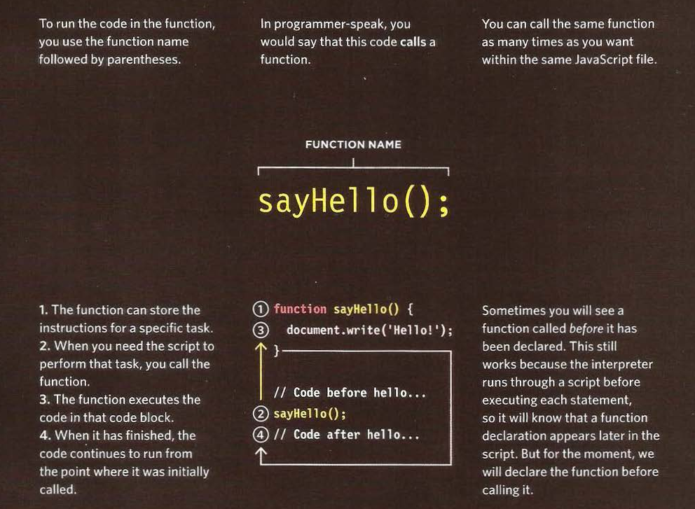

# HTML & ***CSS***

## Chaprter 6: Tables

## What's a Table?

- A ***table*** represents information in a grid format.Examples of tables include financial reports, TV schedules, and sports results.

## Basic Table Structure

- <***table***>

The <***table***> element is used to create a table. The contents of the table are written out row by row.

- <***tr***>

You indicate the start of each row using the opening <***tr***> tag. (The tr stands for table row.) It is followed by one or more <***td***> elements (one for each cell in that row).

At the end of the row you use a
closing </***tr***> tag.

- <***td***>

Each cell of a table is represented using a <***td***> element. (The td stands for table data.) At the end of each cell you use a closing </***td***> tag.

-Some browsers automatically draw lines around the table and/or the individual cells.

***Example:***

## Table Headings

- <***th***>
The <***th***> element is used just like the <***td***> element but its purpose is to represent the heading for either a column or a row. (The th stands for table heading.)

- Even if a cell has no content, you should still use a <***td***> or <***th***> element to represent the presence of an empty cell otherwise the table will not render correctly. (The first cell in the first row of this example shows an empty cell.)

## Spanning Rows & Columns

- Sometimes you may need the entries in a table to stretch across more than one column.

- The ***colspan*** attribute can be used on a <***th***> or <***td***> element and indicates how many columns that cell should run across.

***Example:***

- You may also need entries in a table to stretch down across more than one row.

- The ***rowspan*** attribute can be used on a <***th***> or <***td***> element to indicate how many rows a cell should span down the table.

***Example:***

## Long Tables

- There are three elements that help distinguish between the main content of the table and the first and last rows (which can contain different content).

- These elements help people who use screen readers and also allow you to style these sections in a different manner than the rest of the table (as you will see when you learn about ***CSS***).

<***thead***>

- The headings of the table should sit inside the <***thead***> element.

<***tbody***>

- The body should sit inside the <***tbody***> element.

<***tfoot***>

- The footer belongs inside the <***tfoot***> element.

- By default, browsers rarely treat the content of these elements any differently than other elements however designers often use ***CSS*** styles to change their appearance.

***Example:***

## JavaScript

## Chapter 3: Functions, Methods, and Objects

# Functions

## What is a function?

- **Functions** let you group a series of statements together to perform a
specific task.

- ## **Function declaration:**

- ## **Calling a function:**

- ## **Declaring functions that needs information**

## CREATING· OBJECTS USING LITERAL NOTATION

## ADDING AND REMOVING PROPERTIES

- Once you have created an object (using literal or constructor notation), you can add new properties to it.

## OBJECTS

## Article Summary: Domain Modeling

### Whats is Domain modeling

- Domain modeling is the process of creating a conceptual model in code for a specific problem. A model describes the various entities, their attributes and behaviors, as well as the constraints that govern the problem domain. An entity that stores data in properties and encapsulates behaviors in methods is commonly referred to as an ***object-oriented model***.

- A domain model that's articulated well can verify and validate the understanding of a specific problem among various stakeholders. As a communication tool, it defines a vocabulary that can be used within and between both technical and business teams.

- This is object-oriented programming in JavaScript at its most fundamental level.

1. The new keyword instantiates (i.e. creates) an object.
2. The constructor function initializes properties inside that object using the this variable.
3. The object is stored in a variable for later use.

***Domain modeling*** is the process of creating a conceptual model for a specific problem. And a domain model that's articulated well can verify and validate your understanding of that problem.

- Here's some tips to follow when building your own domain models.

1. When modeling a single entity that'll have many instances, build self-contained objects with the same attributes and behaviors.
2. Model its attributes with a constructor function that defines and initializes properties.
3. Model its behaviors with small methods that focus on doing one job well.
4. Create instances using the new keyword followed by a call to a constructor function.
5. Store the newly created object in a variable so you can access its properties and methods from outside.
6. Use the this variable within methods so you can access the object's properties and methods from inside.

**References:**

- HTML & ***CSS*** Design and Build Websites
by Jon Duckett [Get the book](https://www.amazon.com/HTML-***CSS***-Design-Build-Websites/dp/1118008189)

- JavaScript and JQuery: Interactive Front-End Web Development
by Jon Duckett [Get the book](https://www.amazon.com/JavaScript-JQuery-Interactive-Front-End-Development/dp/1118531647)

-Domain Modeling [Read the full article here](https://github.com/codefellows/domain_modeling#domain-modeling)

## [Main page](https://amjadmesmar.github.io/reading-notes/)
