# CSS

## Chapter 15: Layouts

## Key Concepts in Positioning Elements

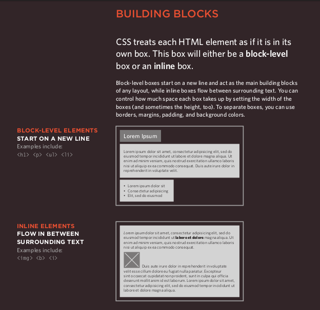

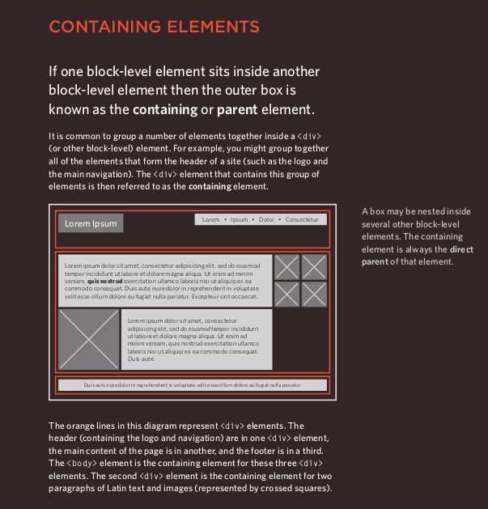

## Controlling the Position of Elements

- ***CSS*** has the following positioning schemes that allow you to control the layout of a page: **normal flow**, **relative positioning**, and **absolute positioning**. You specify the positioning scheme using the position property in ***CSS***. You can also float elements using the float property.

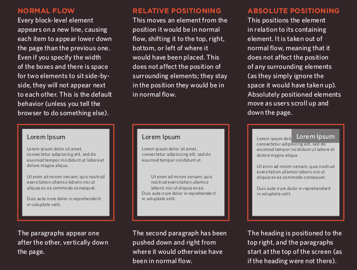

- To indicate where a box should be positioned, you may also need to use box offset properties to tell the browser how far from the top or bottom and left or right it should be placed. (You will meet these when we introduce the positioning schemes on the following pages.)

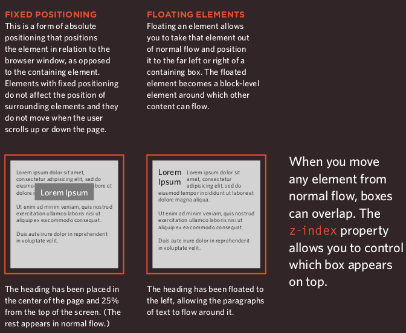

## Normal Flow

***position:static***

- In ***normal flow***, each block-level
element sits on top of the next
one. Since this is the default
way in which browsers treat
***HTML*** elements, you do not
need a ***CSS*** property to indicate
that elements should appear
in normal flow, but the syntax
would be.

## Relative positioning

***position:relative***

- ***Relative positioning*** moves an element in relation to where it would have been in ***normal flow***.

-You can indicate that an element should be relatively positioned using the position property with a value of relative.

***Example:***

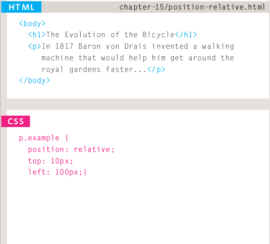
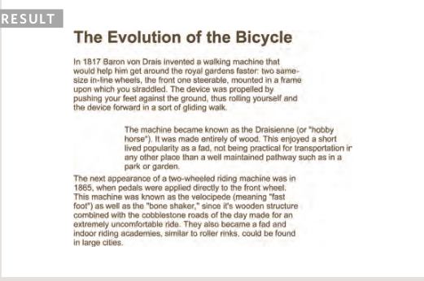

## Absolute Positioning

***position:absolute***

- When the position property is given a value of absolute , the box is taken out of normal flow and no longer affects the position of other elements on the page. (They act like it is not there.)

- The box offset properties (***top*** or ***bottom*** and ***left*** or ***right***) specify where the element should appear in relation to its containing element.

***Example:***

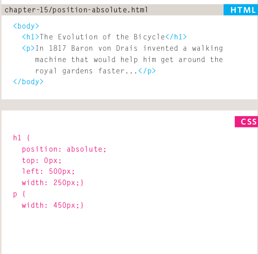
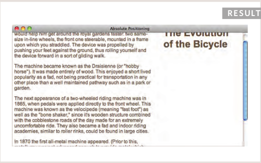

## Fixed positioning

***position:fixed***

- ***Fixed positioning*** is a type of ***absolute positioning*** that requires the position property to have a value of fixed .

- It positions the element in relation to the browser window. Therefore, when a user scrolls down the page, it stays in the exact same place.

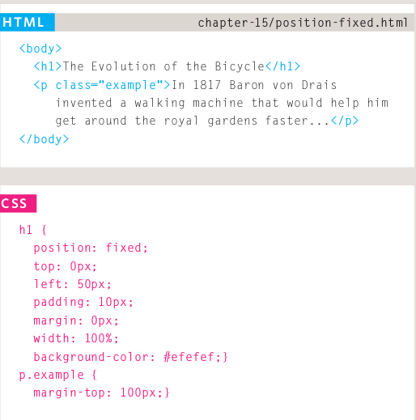
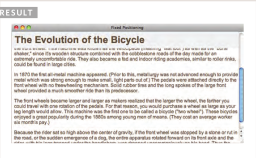

## Fixed Width Layouts

- Fixed width layout designs do not change size as the user increases or decreases the size of their browser window. Measurements tend to be given in pixels.

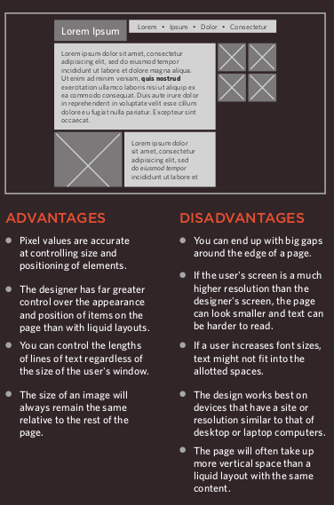

## Liquid Layouts

- Liquid layout designs stretch and contract as the user increases or decreases the size of their browser window. They tend to use percentages.

- Because liquid layouts can stretch the entire width of the browser, resulting in long lines of text that are hard to read, some liquid layouts only let part of the page expand and contract. Other parts of the page have minimum and maximum widths.

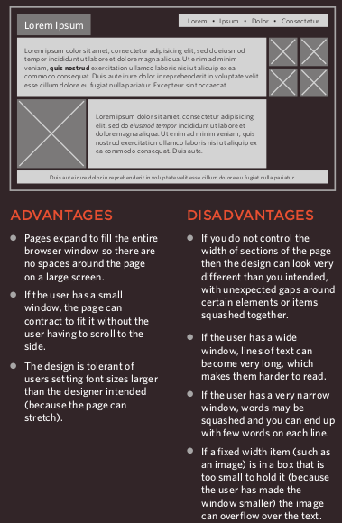

**References:**

- HTML & CSS Design and Build Websites
by Jon Duckett [Get the book](https://www.amazon.com/HTML-CSS-Design-Build-Websites/dp/1118008189)

## [Main page](https://amjadmesmar.github.io/reading-notes/)