# HTML & CSS

## Chapter 7: Forms

- Traditionally, the term '***form***' has referred to a printed document that contains spaces for you to fill in information.

## How Forms Work

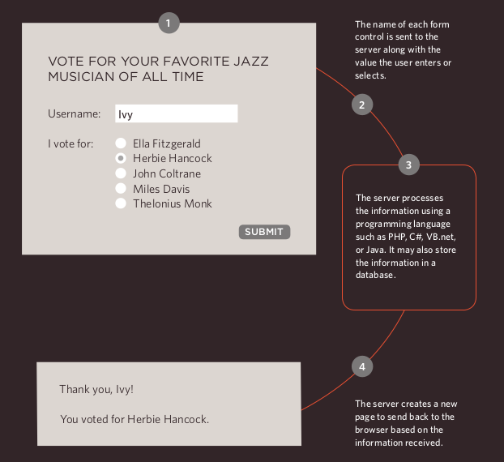

- A ***form*** may have several form controls, each gathering different information. The server needs to know which piece of inputted data corresponds with which form element.

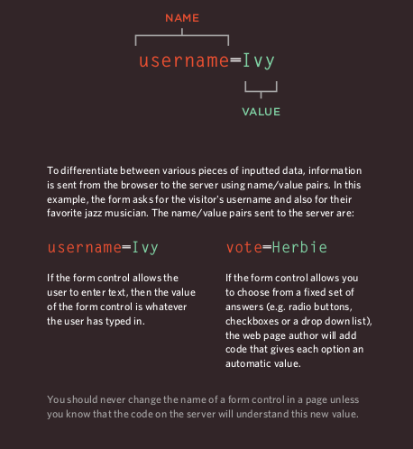

## Checkbox

<***input***>

- ***type="checkbox"***

***Checkboxes*** allow users to select (and unselect) one or more options in answer to a question.

- ***name***

The name attribute is sent to the server with the value of the option(s) the user selects. When a question provides users with options for answers in the form of ***checkboxes***, the value of the name attribute should be the same for all of the buttons that answer that question.

- ***value***

The value attribute indicates the value sent to the server if this ***checkbox*** is checked. checked The checked attribute indicates that this box should be checked when the page loads. If used, its value should be checked .

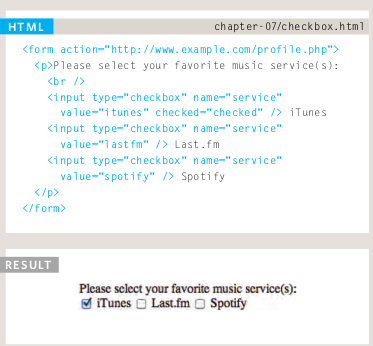

## Image Button

<***input***>

***type="image"***

- If you want to use an image for the submit button, you can give the type attribute a value of
image . The src , width , height , and alt attributes work just like they do when used with the <***img***> element.

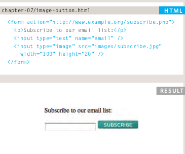

## Chapter 14: Lists, Tables & Forms

## Article Point Styles

***list-style-type***

- The ***list-style-type*** property allows you to control the shape or style of a bullet point (also known as a marker). It can be used on rules that apply to the <***ol***> , <***ul***> , and <***li***>elements. 

- ***Unordered Lists*** For an unordered list you can use the following values:

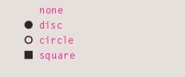

- ***Ordered Lists*** For an ordered (numbered) list you can use the following values:

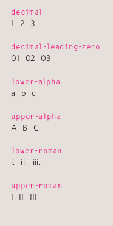

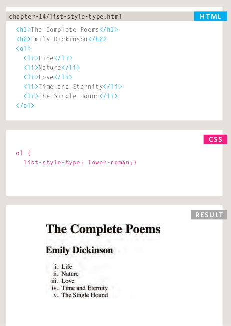

## Table Properties

- ***width*** to set the width of the table.

- ***padding*** to set the space between the border of each table cell and its content.

- ***text-transform*** to convert the content of the table headers to uppercase.

- ***letter-spacing***, ***font-size*** to add additional styling to the content of the table headers.

- ***border-top,*** ***border-bottom*** to set borders above and below the table headers.

- ***text-align*** to align the writing to the left of some table cells and to the right of the others.

- ***background-color*** to change the background color of the alternating table rows.

- ***:hover*** to highlight a table row when a user's mouse goes over it.

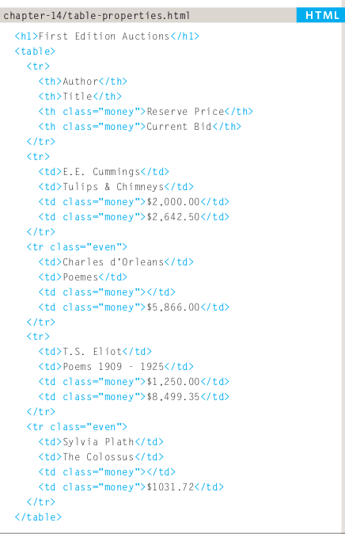

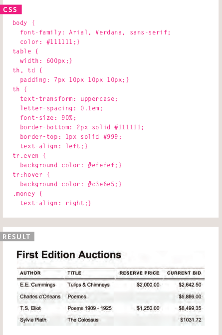

## JAVASCRIPT

## Chapter 6: Events

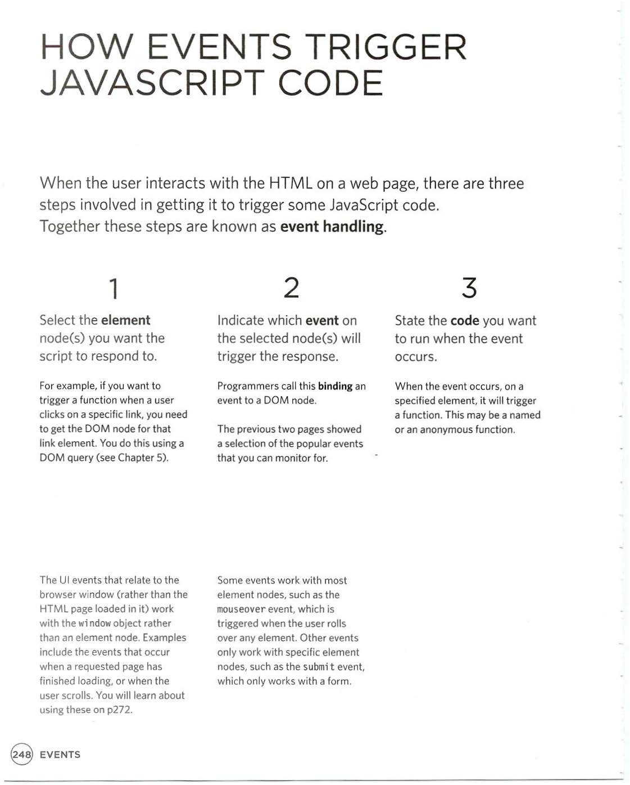

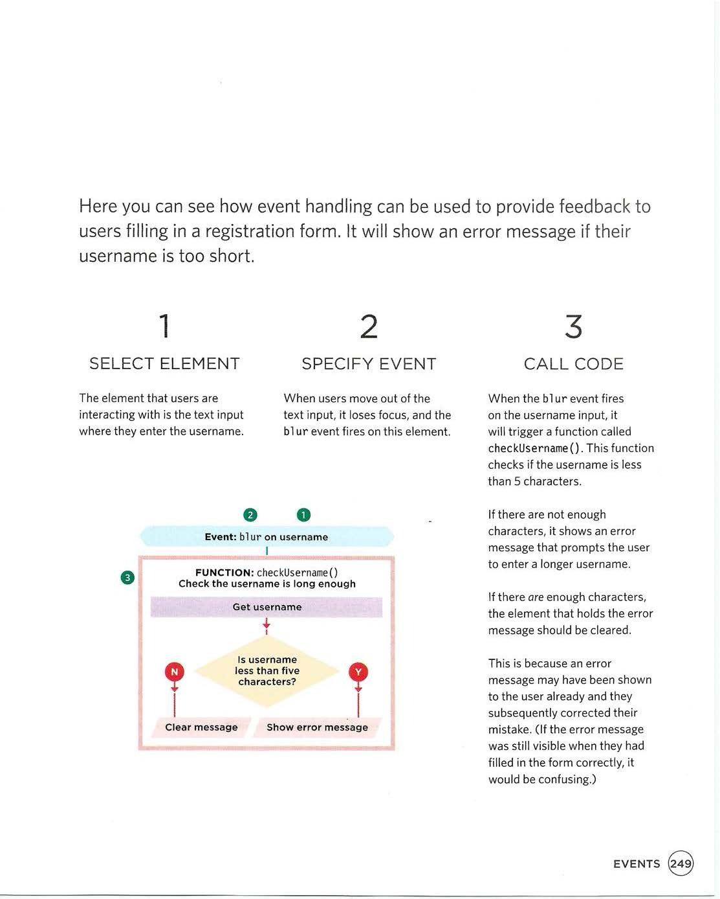

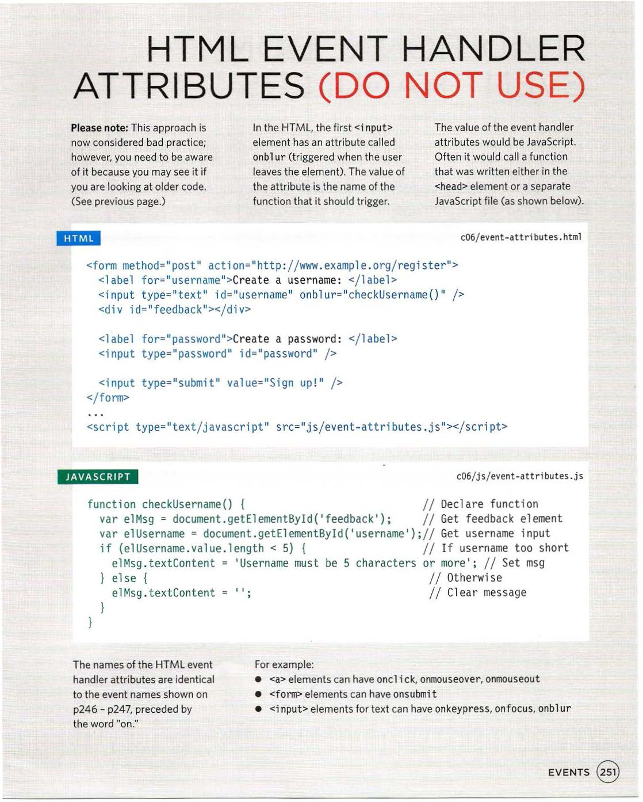

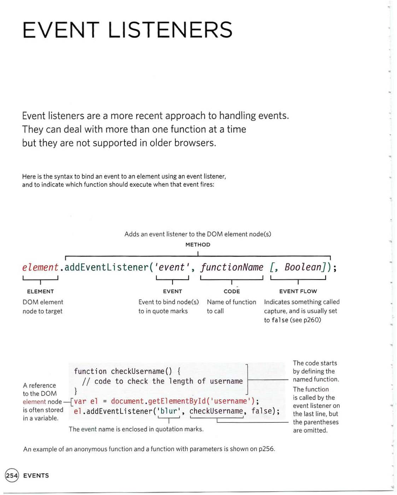

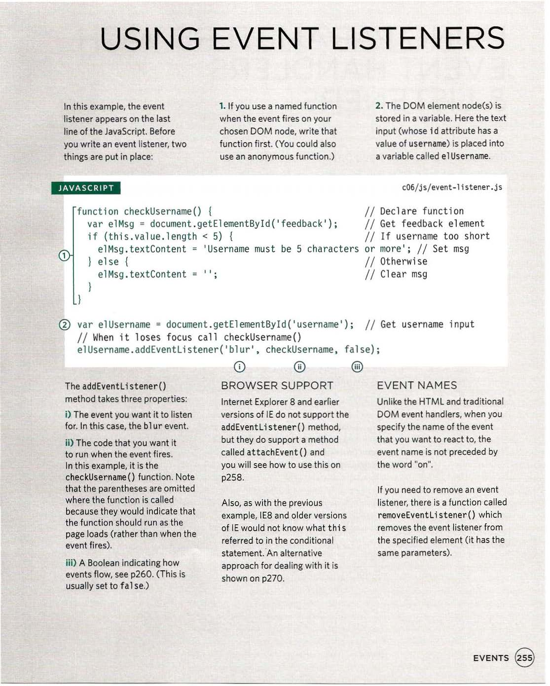

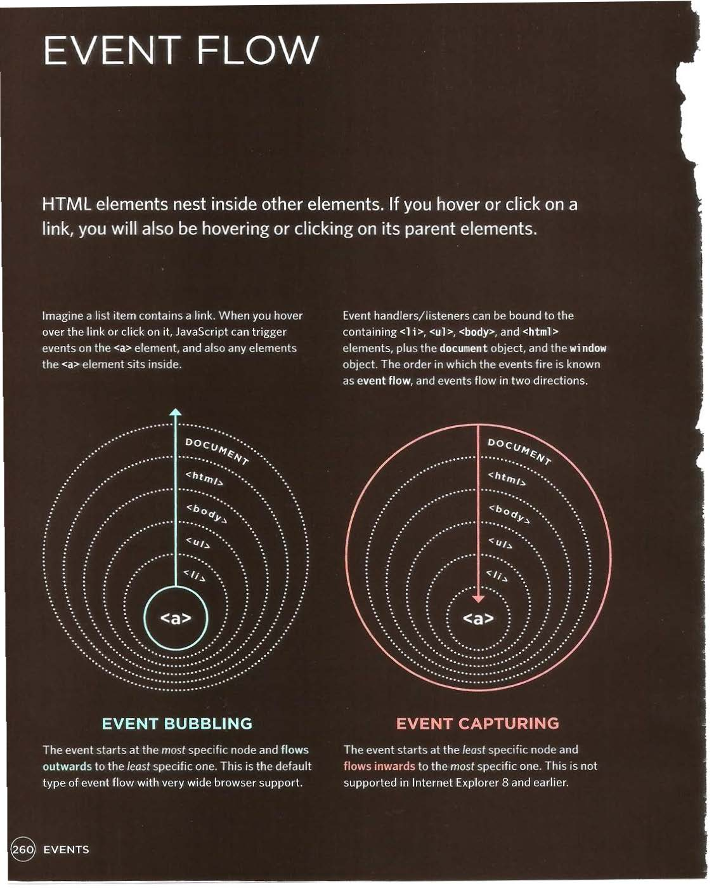

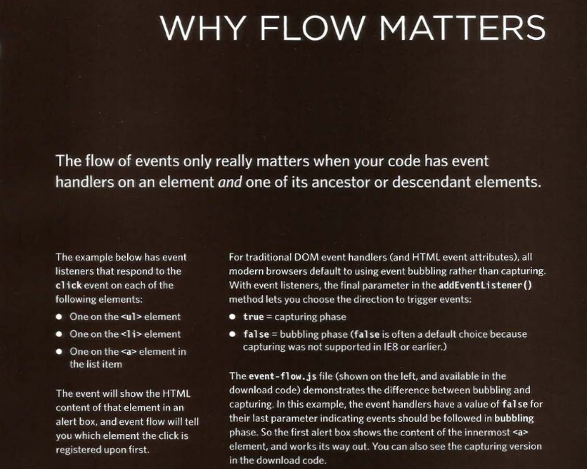

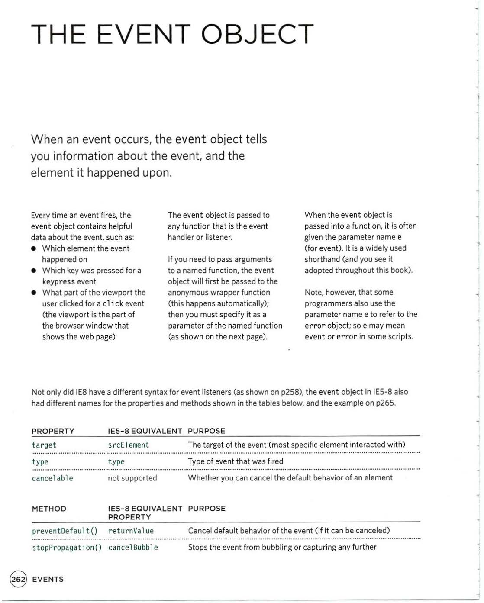

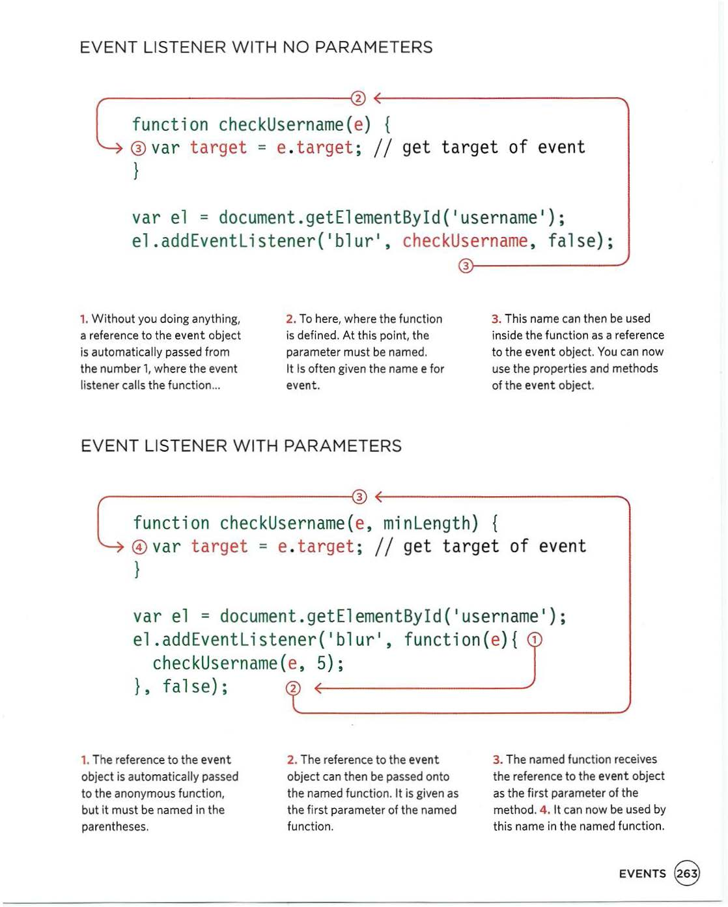

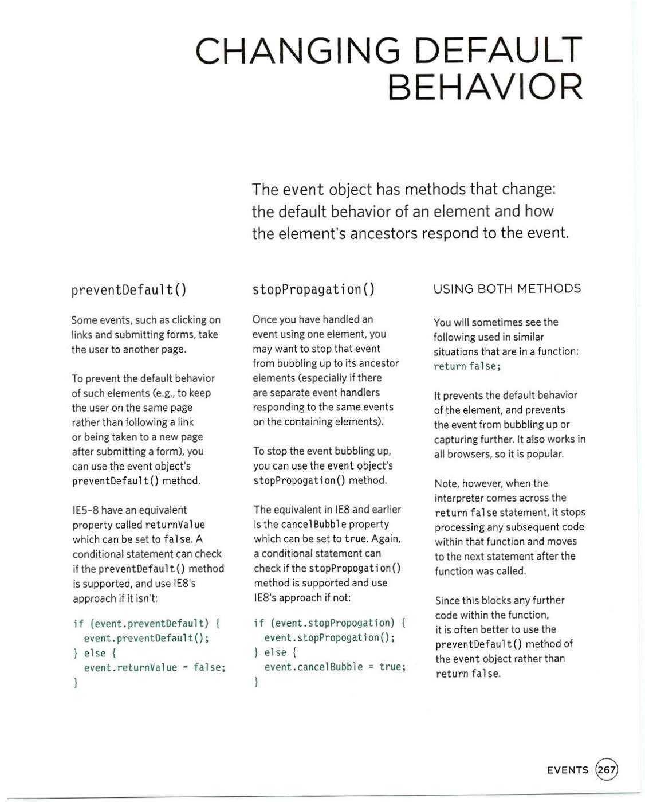

**References:**

- HTML & CSS Design and Build Websites
by Jon Duckett [Get the book](https://www.amazon.com/HTML-CSS-Design-Build-Websites/dp/1118008189)

- JavaScript and JQuery: Interactive Front-End Web Development
by Jon Duckett [Get the book](https://www.amazon.com/JavaScript-JQuery-Interactive-Front-End-Development/dp/1118531647)

## [Main page](https://amjadmesmar.github.io/reading-notes/)
