# JavaScript

## Chapter 10: Error Handling & Debugging

## ORDER OF EXECUTION

- To find the source of an error, it helps to know how scripts are processed. The order in which statements are executed can be complex; some tasks cannot complete until another statement or function has been run:

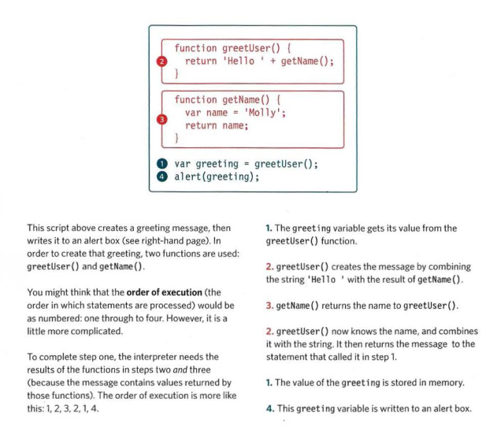

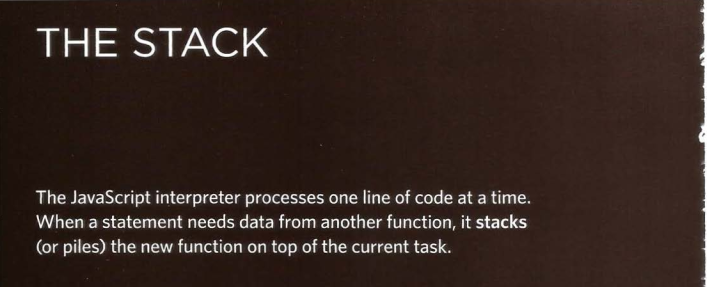

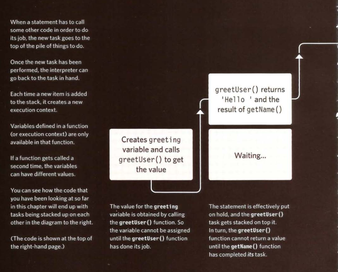

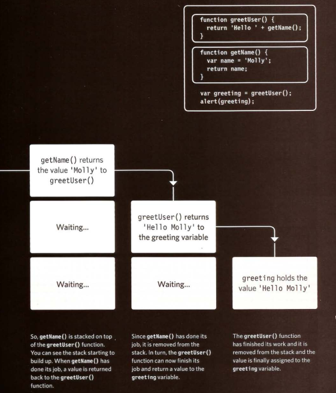

## EXECUTION CONTEXT & HOISTING

- Each time a script enters a new execution context, there are two phases of activity:

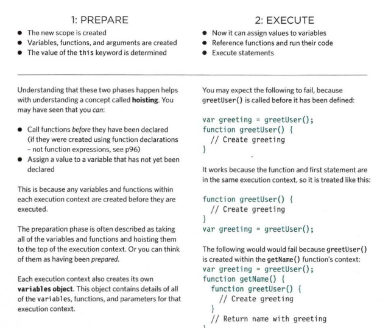

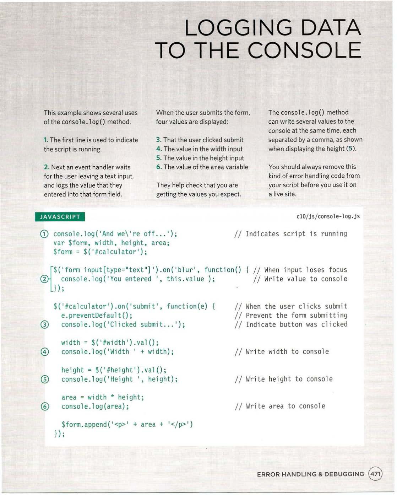

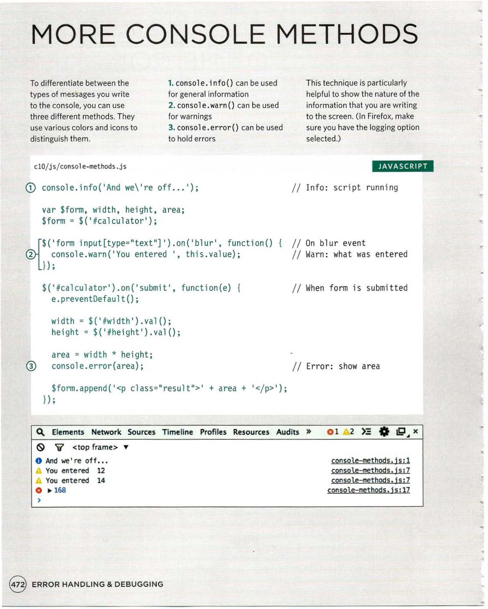

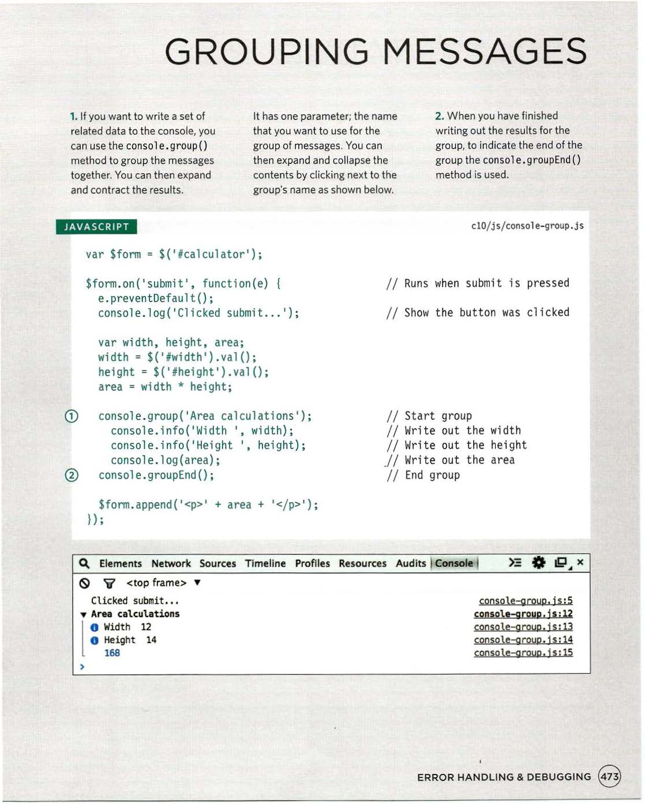

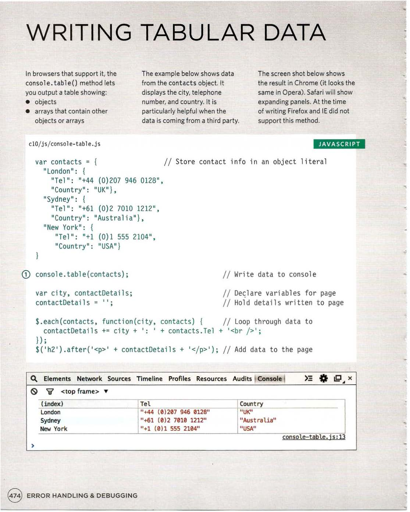

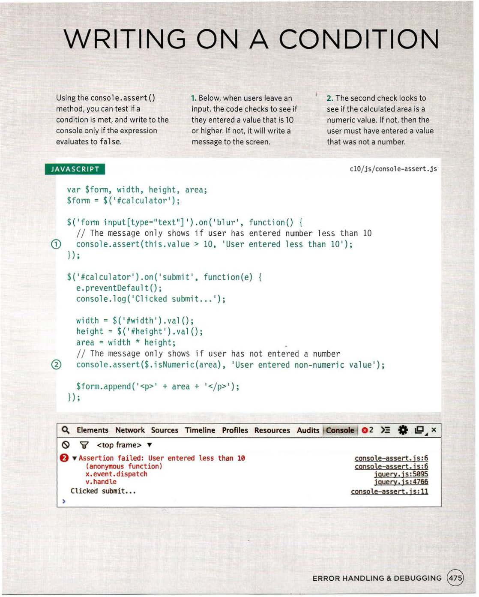

## BREAKPOINTS

- You can pause the execution of a script on any line using breakpoints. Then you can check the values stored in variables at that point in time.

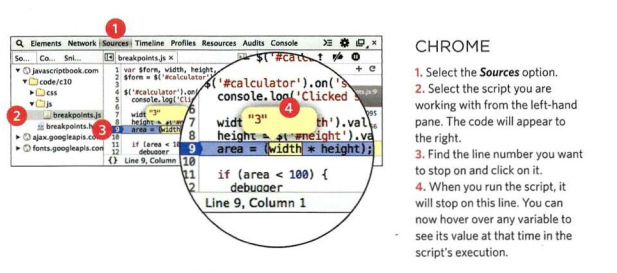

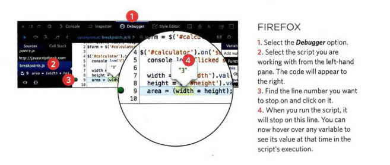

## STEPPING THROUGH CODE

- If you set multiple breakpoints, you can step through them one-by-one to see where values change and a problem might occur.

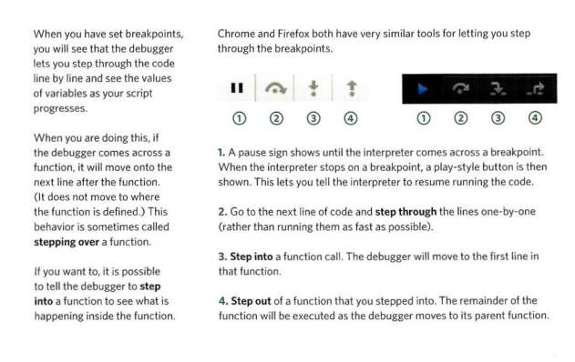

## CONDITIONAL BREAKPOINTS

- You can indicate that a breakpoint should be triggered only if a condition that you specify is met. The condition can use existing variables.

## HANDLING EXCEPTIONS

- If you know your code might fail, use try, catch, and finally. Each one is given its own code block.

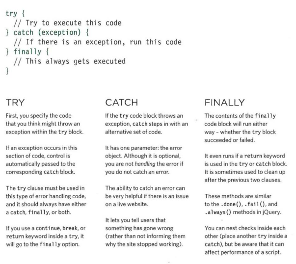

## TRY, CATCH, FINALLY

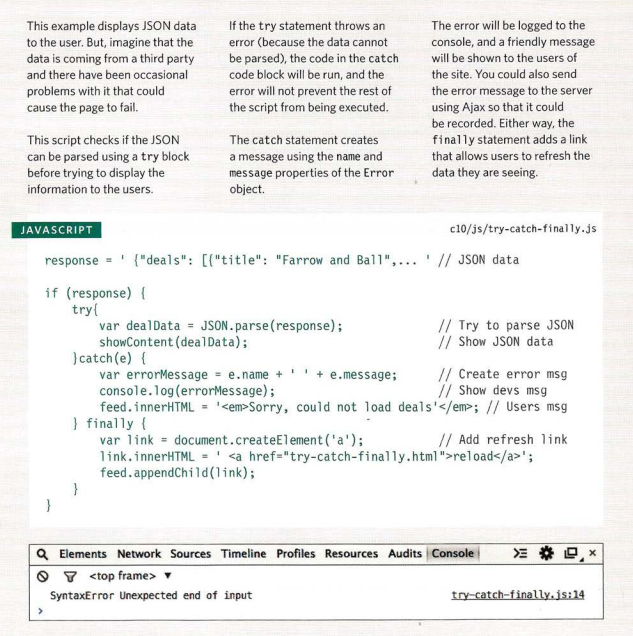

**References:**

- JavaScript and JQuery: Interactive Front-End Web Development
by Jon Duckett [Get the book](https://www.amazon.com/JavaScript-JQuery-Interactive-Front-End-Development/dp/1118531647)

## [Main page](https://amjadmesmar.github.io/reading-notes/)
