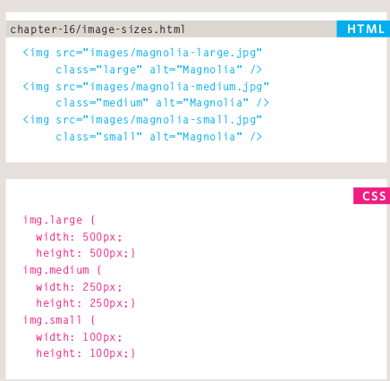
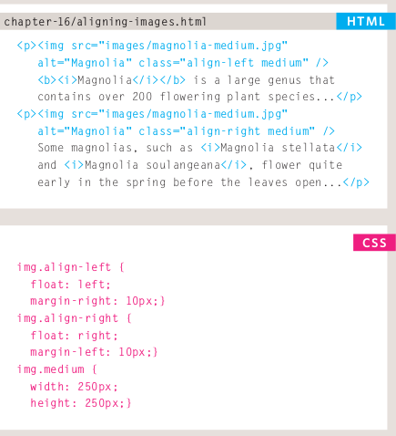
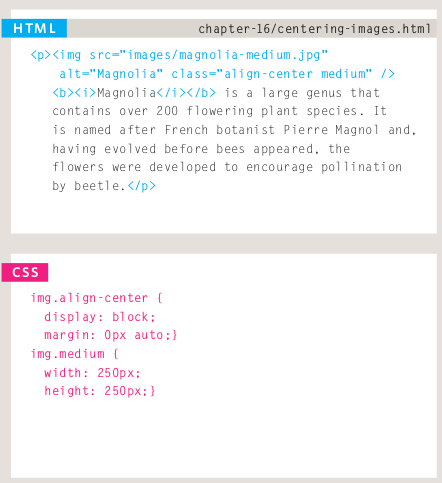
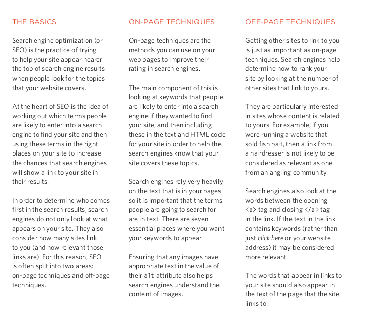
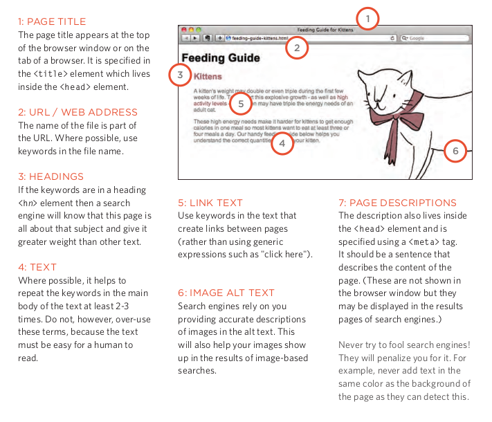
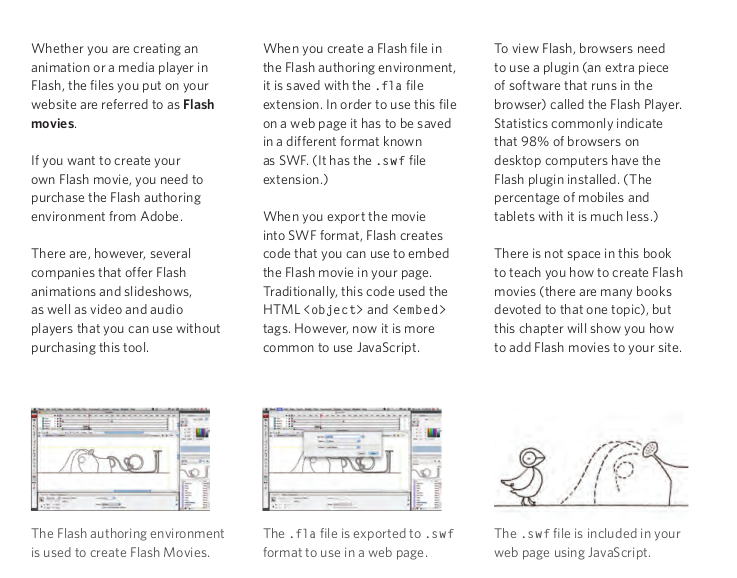
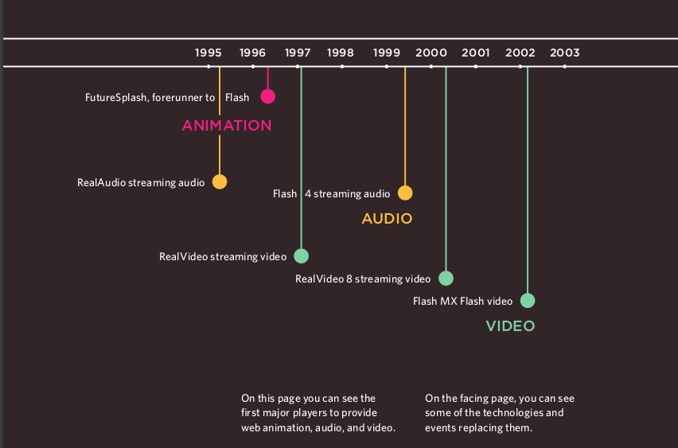
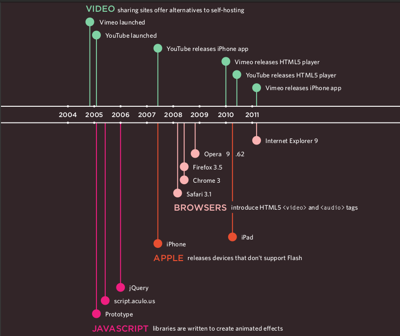

# HTML & CSS

## Chapter 16: Images

## ontrolling sizes of images in CSS

## AligNing images Using CSS

## Centering images Using CSS

## Chapter 19: Practical Information

## Search Engine Optimization (SEO)

- ***SEO*** is a huge topic and several books have been written on the subject.

## On-Page SEO

- In every page of your website there are seven key places where keywords (the words people might search on to find your site) can appear in order to improve its findability.

## Domain Names & Hosting

- In order to put your site on the web you will need a domain name and web hosting.

## Chapter 9: Flash, Video & Audio

## How Flash Works

- Since the late 1990s, Flash has been a very popular tool for creating animations, and later for playing audio and video in websites.

## Timeline: Flash, VidEo & Audio

- Web technologies change quickly. Here you can see some of the changes in how animation, video, and audio are created on the web.

## Article Summary: Video and Audio APIs

- The <***video***> and <***audio***> elements allow us to embed video and audio into web pages. As we showed in Video and audio content, a typical implementation looks like this:

      <video controls>
      <source src="rabbit320.mp4" type="video/mp4">
      <source src="rabbit320.webm" type="video/webm">
      
Your browser doesn't support HTML5 video. Here is a <a href="rabbit320.mp4">link to the video</a> instead.

      </video>

## The HTMLMediaElement API

- Part of the HTML5 spec, the ***HTMLMediaElement*** API provides features to allow you to control video and audio players programmatically — for example ***HTMLMediaElementplay()***., ***HTMLMediaElement.pause()***., etc This interface is available to both <***audio***> and <***video***> elements, as the features you'll want to implement are nearly identical.

- The ***HTMLMediaElement*** API makes a wealth of functionality available for creating simple video and audio players, and that's only the tip of the iceberg. See the "See also" section below for links to more complex and interesting functionality.

**References:**

- HTML & CSS Design and Build Websites
by Jon Duckett [Get the book](https://www.amazon.com/HTML-CSS-Design-Build-Websites/dp/1118008189)

- Video and Audio APIs [Read the full article here](https://developer.mozilla.org/en-US/docs/Learn/JavaScript/Client-side_web_APIs/Video_and_audio_APIs)

## [Main page](https://amjadmesmar.github.io/reading-notes/)