# Article Summaries

## Article 1: EASILY CREATE STUNNING ANIMATED CHARTS WITH CHART.JS

- Charts are far better for displaying data visually than tables and have the added benefit that no one is ever going to press-gang them into use as a layout tool. They’re easier to look at and convey data quickly but they’re not always easy to create.

- A great way to get started with charts is with ***Chart.js***, a JavaScript plugin that uses HTML5’s canvas element to draw the graph onto the page. It’s a well documented plugin that makes using all kinds of bar charts, line charts, pie charts and more, incredibly easy.

## Setting up

- The first thing we need to do is download Chart.js. Copy the Chart.min.js out of the unzipped folder and into the directory you’ll be working in. Then create a new html page and import the script:

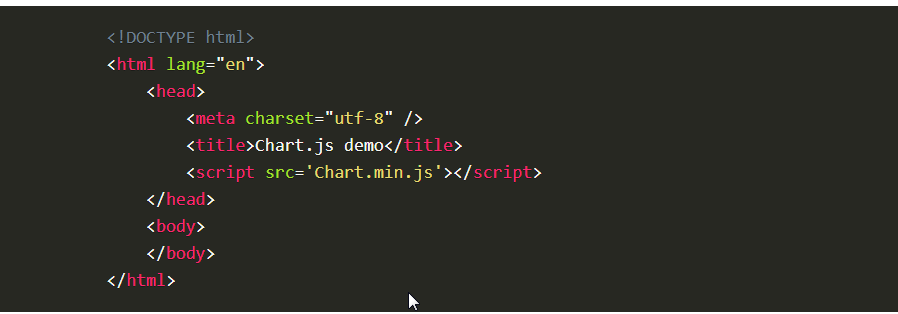

## Drawing a line chart

- To draw a line chart, the first thing we need to do is create a canvas element in our HTML in which Chart.js can draw our chart. So add this to the body of our HTML page:

Next, we need to write a script that will retrieve the context of the canvas, so add this to the foot of your body element:

- (We can actually pass some options to the chart via the Line method, but we’re going to stick to the data for now to keep it simple.)

Inside the same script tags we need to create our data, in this instance it’s an object that contains labels for the base of our chart and datasets to describe the values on the chart. Add this immediately above the line that begins ‘var buyers=’:

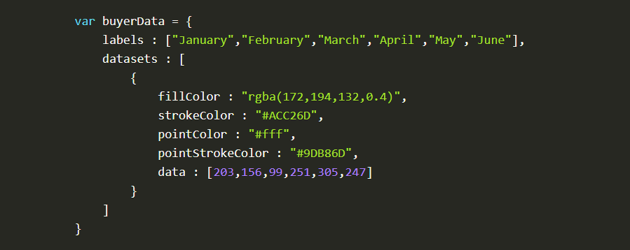

If you test your file in a browser you’ll now see a cool animated line graph.

## Article 2: Basic usage of canvas

- At first sight a <***canvas***> looks like the <***img***> element, with the only clear difference being that it doesn't have the src and alt attributes. Indeed, the <***canvas***> element has only two attributes, width and height. These are both optional and can also be set using DOM properties. When no width and height attributes are specified, the canvas will initially be 300 pixels wide and 150 pixels high. The element can be sized arbitrarily by CSS, but during rendering the image is scaled to fit its layout size: if the CSS sizing doesn't respect the ratio of the initial canvas, it will appear distorted.

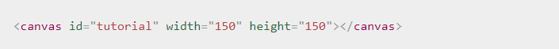

## Fallback content

-The <***canvas***> element differs from an <***img***> tag in that, like for <***video***>, <***audio***>, or <***picture***> elements, it is easy to define some fallback content, to be displayed in older browsers not supporting it, like versions of Internet Explorer earlier than version 9 or textual browsers. You should always provide fallback content to be displayed by those browsers.

- Providing fallback content is very straightforward: just insert the alternate content inside the <***canvas***> element. Browsers that don't support <***canvas***> will ignore the container and render the fallback content inside it. Browsers that do support <***canvas***> will ignore the content inside the container, and just render the canvas normally.

- For example, we could provide a text description of the canvas content or provide a static image of the dynamically rendered content. This can look something like this:

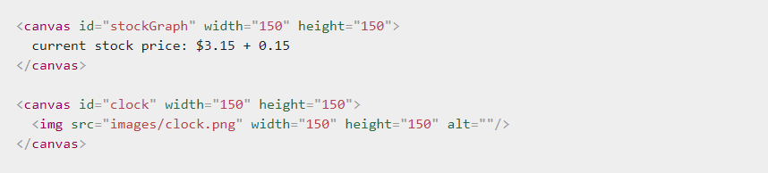

## The rendering context

- The <***canvas***> element creates a fixed-size drawing surface that exposes one or more rendering contexts, which are used to create and manipulate the content shown. In this tutorial, we focus on the 2D rendering context. Other contexts may provide different types of rendering; for example, WebGL uses a 3D context based on OpenGL ES.

- The canvas is initially blank. To display something, a script first needs to access the rendering context and draw on it. The <***canvas***> element has a method called ***getContext()***, used to obtain the rendering context and its drawing functions. ***getContext()*** takes one parameter, the type of context. For 2D graphics, such as those covered by this tutorial, you specify "2d" to get a ***CanvasRenderingContext2D***.

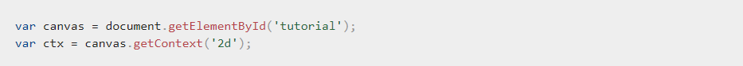

- The first line in the script retrieves the node in the DOM representing the <***canvas***> element by calling the ***document.getElementById()*** method. Once you have the element node, you can access the drawing context using its ***getContext()*** method.

## Article 3: Drawing shapes with canvas

## The grid

- Before we can start drawing, we need to talk about the canvas ***grid*** or coordinate space. Our HTML skeleton from the previous page had a canvas element 150 pixels wide and 150 pixels high. To the right, you see this canvas with the default ***grid*** overlayed. Normally 1 unit in the ***grid*** corresponds to 1 pixel on the canvas. The origin of this ***grid*** is positioned in the top left corner at coordinate (0,0). All elements are placed relative to this origin. So the position of the top left corner of the blue square becomes x pixels from the left and y pixels from the top, at coordinate (x,y). Later in this tutorial we'll see how we can translate the origin to a different position, rotate the ***grid*** and even scale it, but for now we'll stick to the default.

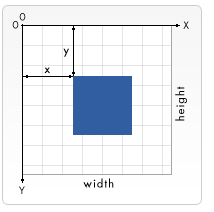

## Drawing rectangles

- Unlike SVG, <***canvas***> only supports two primitive shapes: rectangles and paths (lists of points connected by lines). All other shapes must be created by combining one or more paths. Luckily, we have an assortment of path drawing functions which make it possible to compose very complex shapes.

First let's look at the rectangle. There are three functions that draw rectangles on the canvas:

- Each of these three functions takes the same parameters. x and y specify the position on the canvas (relative to the origin) of the top-left corner of the rectangle. width and height provide the rectangle's size.

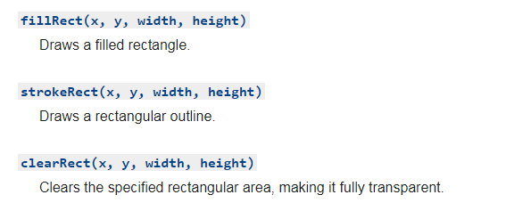

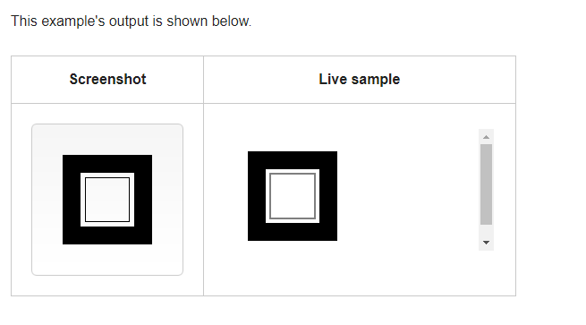

- The ***fillRect()*** function draws a large black square 100 pixels on each side. The ***clearRect()*** function then erases a 60x60 pixel square from the center, and then ***strokeRect()*** is called to create a rectangular outline 50x50 pixels within the cleared square.

In upcoming pages we'll see two alternative methods for ***clearRect()***, and we'll also see how to change the color and stroke style of the rendered shapes.

Unlike the path functions we'll see in the next section, all three rectangle functions draw immediately to the canvas.

## Article 4: Applying styles and colors

## A fillStyle example

- In this example, we once again use two ***for*** loops to draw a grid of rectangles, each in a different color. The resulting image should look something like the screenshot. There is nothing too spectacular happening here. We use the two variables ***i*** and ***j*** to generate a unique RGB color for each square, and only modify the red and green values. The blue channel has a fixed value. By modifying the channels, you can generate all kinds of palettes. By increasing the steps, you can achieve something that looks like the color palettes Photoshop uses.

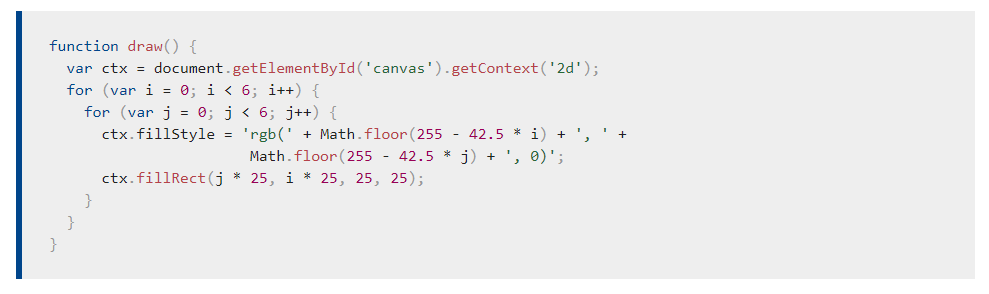
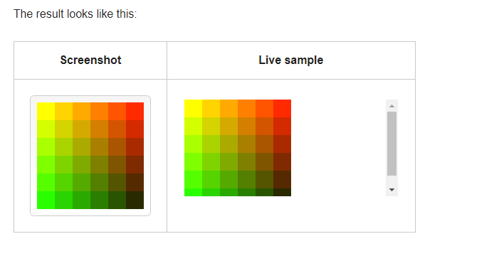

## A globalAlpha example

- In this example, we'll draw a background of four different colored squares. On top of these, we'll draw a set of semi-transparent circles. The ***globalAlpha*** property is set at 0.2 which will be used for all shapes from that point on. Every step in the ***for*** loop draws a set of circles with an increasing radius. The final result is a radial gradient. By overlaying ever more circles on top of each other, we effectively reduce the transparency of the circles that have already been drawn. By increasing the step count and in effect drawing more circles, the background would completely disappear from the center of the image.

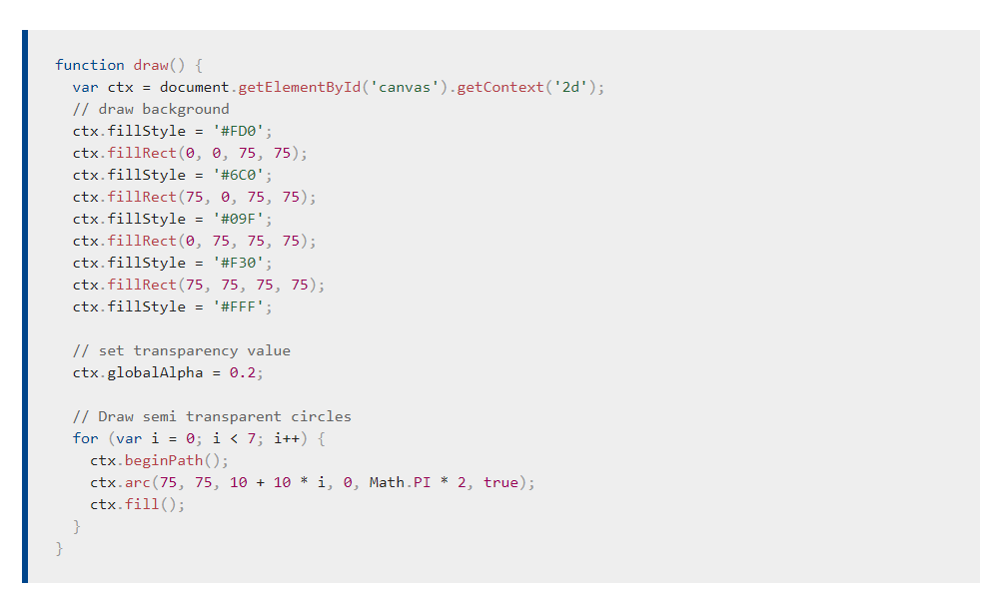
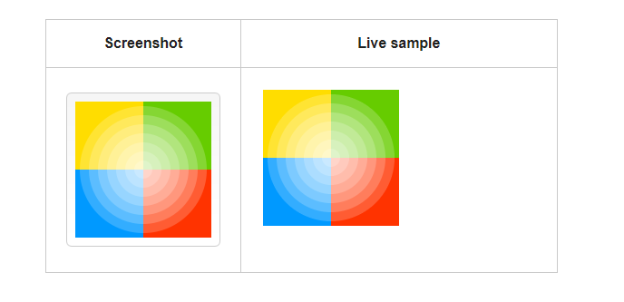

## Article 5: Drawing text

## A fillText example

- The text is filled using the current ***fillStyle***.

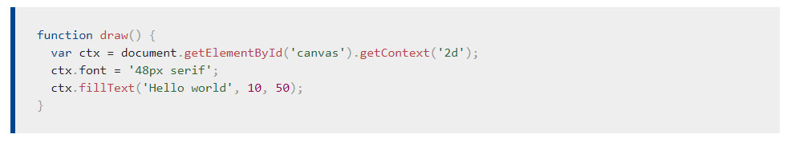
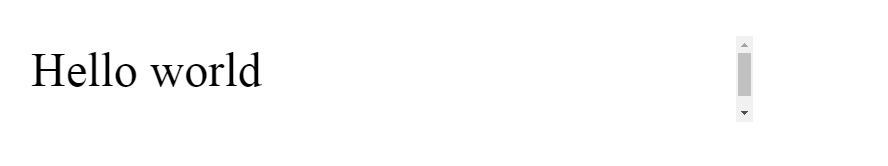

## A strokeText example

- The text is filled using the current ***strokeStyle***.

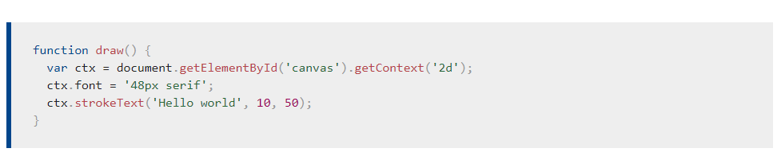

## A textBaseline example

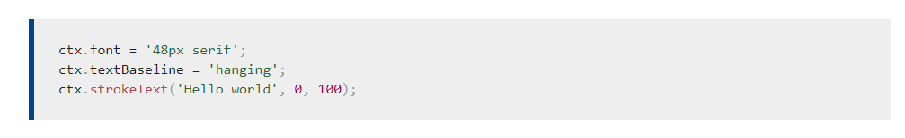
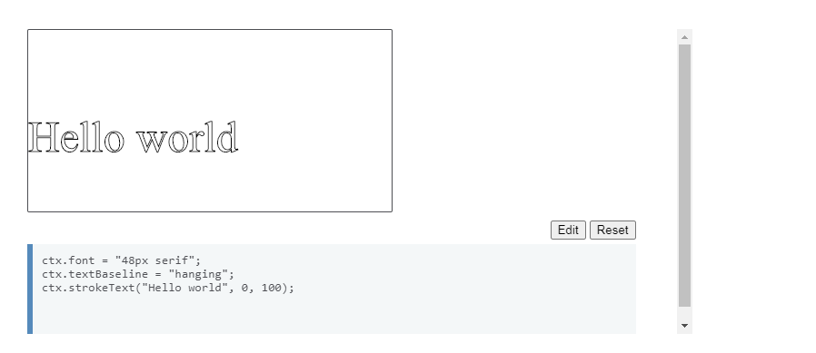
**References:**

- EASILY CREATE STUNNING ANIMATED CHARTS WITH CHART.JS [Read the full article here](https://www.webdesignerdepot.com/2013/11/easily-create-stunning-animated-charts-with-chart-js/)

- Basic usage of canvas [Read the full article here](https://developer.mozilla.org/en-US/docs/Web/API/Canvas_API/Tutorial/Basic_usage/)

- Drawing shapes with canvas [Read the full article here](https://developer.mozilla.org/en-US/docs/Web/API/Canvas_API/Tutorial/Drawing_shapes)

- Applying styles and colors [Read the full article here](https://developer.mozilla.org/en-US/docs/Web/API/Canvas_API/Tutorial/Applying_styles_and_colors)

- Drawing text [Read the full article here](https://developer.mozilla.org/en-US/docs/Web/API/Canvas_API/Tutorial/Drawing_text)

## [Main page](https://amjadmesmar.github.io/reading-notes/)    