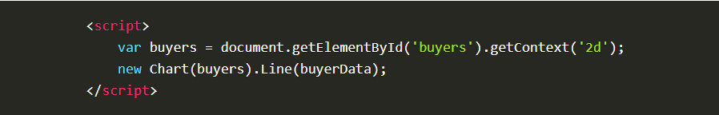

# Article Summaries

## Article 1: EASILY CREATE STUNNING ANIMATED CHARTS WITH CHART.JS

- Charts are far better for displaying data visually than tables and have the added benefit that no one is ever going to press-gang them into use as a layout tool. They’re easier to look at and convey data quickly but they’re not always easy to create.

- A great way to get started with charts is with ***Chart.js***, a JavaScript plugin that uses HTML5’s canvas element to draw the graph onto the page. It’s a well documented plugin that makes using all kinds of bar charts, line charts, pie charts and more, incredibly easy.

## Setting up

- The first thing we need to do is download Chart.js. Copy the Chart.min.js out of the unzipped folder and into the directory you’ll be working in. Then create a new html page and import the script:

## Drawing a line chart

- To draw a line chart, the first thing we need to do is create a canvas element in our HTML in which Chart.js can draw our chart. So add this to the body of our HTML page:

Next, we need to write a script that will retrieve the context of the canvas, so add this to the foot of your body element:

- (We can actually pass some options to the chart via the Line method, but we’re going to stick to the data for now to keep it simple.)

Inside the same script tags we need to create our data, in this instance it’s an object that contains labels for the base of our chart and datasets to describe the values on the chart. Add this immediately above the line that begins ‘var buyers=’:

If you test your file in a browser you’ll now see a cool animated line graph.

## Article 2: Basic usage of canvas

- At first sight a <***canvas***> looks like the <***img***> element, with the only clear difference being that it doesn't have the src and alt attributes. Indeed, the <***canvas***> element has only two attributes, width and height. These are both optional and can also be set using DOM properties. When no width and height attributes are specified, the canvas will initially be 300 pixels wide and 150 pixels high. The element can be sized arbitrarily by CSS, but during rendering the image is scaled to fit its layout size: if the CSS sizing doesn't respect the ratio of the initial canvas, it will appear distorted.

## Fallback content

-The <***canvas***> element differs from an <***img***> tag in that, like for <***video***>, <***audio***>, or <***picture***> elements, it is easy to define some fallback content, to be displayed in older browsers not supporting it, like versions of Internet Explorer earlier than version 9 or textual browsers. You should always provide fallback content to be displayed by those browsers.

- Providing fallback content is very straightforward: just insert the alternate content inside the <***canvas***> element. Browsers that don't support <***canvas***> will ignore the container and render the fallback content inside it. Browsers that do support <***canvas***> will ignore the content inside the container, and just render the canvas normally.

- For example, we could provide a text description of the canvas content or provide a static image of the dynamically rendered content. This can look something like this:

## The rendering context

- The <***canvas***> element creates a fixed-size drawing surface that exposes one or more rendering contexts, which are used to create and manipulate the content shown. In this tutorial, we focus on the 2D rendering context. Other contexts may provide different types of rendering; for example, WebGL uses a 3D context based on OpenGL ES.

- The canvas is initially blank. To display something, a script first needs to access the rendering context and draw on it. The <***canvas***> element has a method called ***getContext()***, used to obtain the rendering context and its drawing functions. ***getContext()*** takes one parameter, the type of context. For 2D graphics, such as those covered by this tutorial, you specify "2d" to get a ***CanvasRenderingContext2D***.

- The first line in the script retrieves the node in the DOM representing the <***canvas***> element by calling the ***document.getElementById()*** method. Once you have the element node, you can access the drawing context using its ***getContext()*** method.

**References:**

- EASILY CREATE STUNNING ANIMATED CHARTS WITH CHART.JS [Read the full article here](https://www.webdesignerdepot.com/2013/11/easily-create-stunning-animated-charts-with-chart-js/)

- Basic usage of canvas [Read the full article here](https://developer.mozilla.org/en-US/docs/Web/API/Canvas_API/Tutorial/Basic_usage/)

- Drawing shapes with canvas [Read the full article here](https://developer.mozilla.org/en-US/docs/Web/API/Canvas_API/Tutorial/Drawing_shapes)

- Applying styles and colors [Read the full article here](https://developer.mozilla.org/en-US/docs/Web/API/Canvas_API/Tutorial/Applying_styles_and_colors)

- Drawing text[Read the full article here](https://developer.mozilla.org/en-US/docs/Web/API/Canvas_API/Tutorial/Drawing_text)

## [Main page](https://amjadmesmar.github.io/reading-notes/)