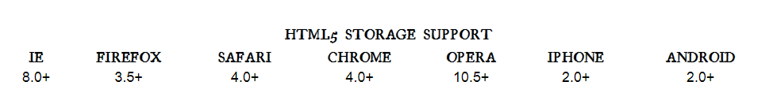
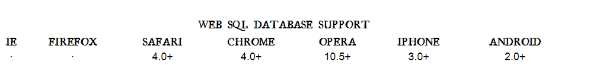

# THE PAST, PRESENT & FUTURE OF LOCAL STORAGE FOR WEB APPLICATIONS

- Historically, web applications have had none of these luxuries. Cookies were invented early in the web’s history, and indeed they can be used for persistent local storage of small amounts of data. But they have three potentially dealbreaking downsides:

1. Cookies are included with every HTTP request, thereby slowing down your web application by needlessly transmitting the same data over and over.

2. Cookies are included with every HTTP request, thereby sending data unencrypted over the internet (unless your entire web application is served over SSL).

3. Cookies are limited to about 4 KB of data — enough to slow down your application (see above), but not enough to be terribly useful.

- What we really want is

1. a lot of storage space.
2. on the client.
3. that persists beyond a page refresh.
4. and isn’t transmitted to the server.

- Before HTML5, all attempts to achieve this were ultimately unsatisfactory in different ways.

## A BRIEF HISTORY OF LOCAL STORAGE HACKS BEFORE HTML5

- In the beginning, there was only Internet Explorer. Or at least, that’s what Microsoft wanted the world to think. To that end, as part of the First Great Browser Wars, Microsoft invented a great many things and included them in their browser-to-end-all-browser-wars, Internet Explorer. One of these things was called ***DHTML Behaviors***, and one of these behaviors was called ***userData***.

- ***userData*** allows web pages to store up to 64 KB of data per domain, in a hierarchical XML-based structure. (Trusted domains, such as intranet sites, can store 10 times that amount. And hey, 640 KB ought to be enough for anybody.) IE does not present any form of permissions dialog, and there is no allowance for increasing the amount of storage available.

## INTRODUCING HTML5 STORAGE

- So what is HTML5 Storage? Simply put, it’s a way for web pages to store named key/value pairs locally, within the client web browser. Like cookies, this data persists even after you navigate away from the web site, close your browser tab, exit your browser, or what have you. Unlike cookies, this data is never transmitted to the remote web server (unless you go out of your way to send it manually). Unlike all previous attempts at providing persistent local storage, it is implemented natively in web browsers, so it is available even when third-party browser plugins are not.

## USING HTML5 STORAGE

- HTML5 Storage is based on named key/value pairs. You store data based on a named key, then you can retrieve that data with the same key. The named key is a string. The data can be any type supported by JavaScript, including strings, Booleans, integers, or floats. However, the data is actually stored as a string. If you are storing and retrieving anything other than strings, you will need to use functions like parseInt() or parseFloat() to coerce your retrieved data into the expected JavaScript datatype.

        interface Storage {
        getter any getItem(in DOMString key);
        setter creator void setItem(in DOMString key, in any data);
        };

- Calling setItem() with a named key that already exists will silently overwrite the previous value. Calling getItem() with a non-existent key will return null rather than throw an exception.

Like other JavaScript objects, you can treat the localStorage object as an associative array. Instead of using the getItem() and setItem() methods, you can simply use square brackets. For example, this snippet of code:

        var foo = localStorage.getItem("bar");
        // ...
        localStorage.setItem("bar", foo);
        …could be rewritten to use square bracket syntax instead:

        var foo = localStorage["bar"];
        // ...
        localStorage["bar"] = foo;

- There are also methods for removing the value for a given named key, and clearing the entire storage area (that is, deleting all the keys and values at once).

        interface Storage {
        deleter void removeItem(in DOMString key);
        void clear();
      };

- Calling removeItem() with a non-existent key will do nothing.

- Finally, there is a property to get the total number of values in the storage area, and to iterate through all of the keys by index (to get the name of each key).

      interface Storage {
      readonly attribute unsigned long length;
        getter DOMString key(in unsigned long index);
        };

## BEYOND NAMED KEY-VALUE PAIRS: COMPETING VISIONS

- While the past is littered with hacks and workarounds, the present condition of HTML5 Storage is surprisingly rosy. A new API has been standardized and implemented across all major browsers, platforms, and devices. As a web developer, that’s just not something you see every day, is it? But there is more to life than “5 megabytes of named key/value pairs,” and the future of persistent local storage is… how shall I put it… well, there are competing visions.

- One vision is an acronym that you probably know already: SQL. In 2007, Google launched Gears, an open source cross-browser plugin which included an embedded database based on SQLite. This early prototype later influenced the creation of the Web SQL Database specification. Web SQL Database (formerly known as “WebDB”) provides a thin wrapper around a SQL database, allowing you to do things like this from JavaScript:

- As you can see, most of the action resides in the string you pass to the executeSql method. This string can be any supported SQL statement, including SELECT, UPDATE, INSERT, and DELETE statements. It’s just like backend database programming, except you’re doing it from JavaScript! Oh joy!

The Web SQL Database specification has been implemented by four browsers and platforms.

**References:**

- THE PAST, PRESENT & FUTURE OF LOCAL STORAGE FOR WEB APPLICATIONS [Read the full article here](http://diveinto.html5doctor.com/storage.html/)

## [Main page](https://amjadmesmar.github.io/reading-notes/)