# What Google Learned From Its Quest to Build the Perfect Team

- THE WORK ISSUE: REIMAGINING THE OFFICE:

1. How to Build a Perfect Team
2. The War on Meetings
3. The Case for Blind Hiring
4. Failure to Lunch
5. The 'Good Jobs' Gamble
6. Rethinking the Work-Life Equation
7. The Rise of White-Collar Automation
8. The Post-Cubicle Office
9. The New Dream Jobs

Yet many of today’s most valuable firms have come to realize that analyzing and improving individual workers a practice known as ‘‘employee performance optimization’’ — isn’t enough. As commerce becomes increasingly global and complex, the bulk of modern work is more and more team-based. One study, published in The Harvard Business Review last month, found that ‘‘the time spent by managers and employees in collaborative activities has ballooned by 50 percent or more’’ over the last two decades and that, at many companies, more than three-quarters of an employee’s day is spent communicating with colleagues.

What Project Aristotle has taught people within Google is that no one wants to put on a ‘‘work face’’ when they get to the office. No one wants to leave part of their personality and inner life at home. But to be fully present at work, to feel ‘‘psychologically safe,’’ we must know that we can be free enough, sometimes, to share the things that scare us without fear of recriminations. We must be able to talk about what is messy or sad, to have hard conversations with colleagues who are driving us crazy. We can’t be focused just on efficiency. Rather, when we start the morning by collaborating with a team of engineers and then send emails to our marketing colleagues and then jump on a conference call, we want to know that those people really hear us. We want to know that work is more than just labor.

Which isn’t to say that a team needs an ailing manager to come together. Any group can become Team B. Sakaguchi’s experiences underscore a core lesson of Google’s research into teamwork: By adopting the data-driven approach of Silicon Valley, Project Aristotle has encouraged emotional conversations and discussions of norms among people who might otherwise be uncomfortable talking about how they feel. ‘‘Googlers love data,’’ Sakaguchi told me. But it’s not only Google that loves numbers, or Silicon Valley that shies away from emotional conversations. Most work­places do. ‘‘By putting things like empathy and sensitivity into charts and data reports, it makes them easier to talk about,’’ Sakaguchi told me. ‘‘It’s easier to talk about our feelings when we can point to a number.’’

## CSS TRANSFORMS

- The transform property comes in two different settings, two-dimensional and three-dimensional. Each of these come with their own individual properties and values.

- The actual syntax for the transform property is quite simple, including the transform property followed by the value. The value specifies the transform type followed by a specific amount inside parentheses.

        div {
        -webkit-transform: scale(1.5);
        -moz-transform: scale(1.5);
        -o-transform: scale(1.5);
        transform: scale(1.5);
        }

- Notice how the transform property includes multiple vendor prefixes to gain the best support across all browsers. The un-prefixed declaration comes last to overwrite the prefixed versions, should a browser fully support the transform property.

## 2D Transforms

- Two-dimensional transforms work on the x and y axes, known as horizontal and vertical axes. Three-dimensional transforms work on both the x and y axes, as well as the z axis. These three-dimensional transforms help define not only the length and width of an element, but also the depth. We’ll start by discussing how to transform elements on a two-dimensional plane, and then work our way into three-dimensional transforms.

## 2D Rotate

- The transform property accepts a handful of different values. The rotate value provides the ability to rotate an element from 0 to 360 degrees. Using a positive value will rotate an element clockwise, and using a negative value will rotate the element counterclockwise. The default point of rotation is the center of the element, 50% 50%, both horizontally and vertically. Later we will discuss how you can change this default point of rotation.

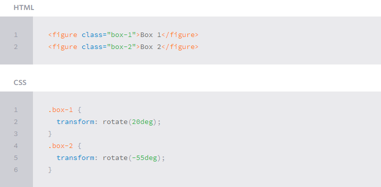
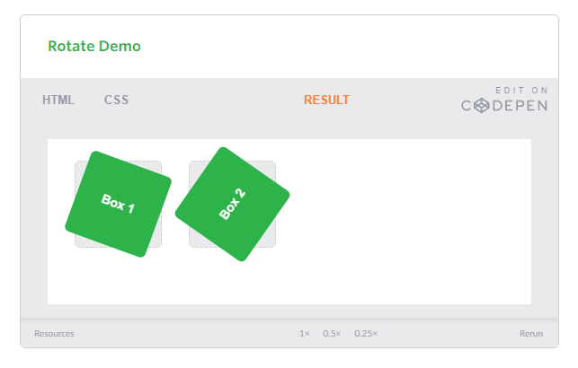

The gray box behind the rotated element symbolizes the original position of the element. Additionally, upon hover the box will rotate 360 degrees horizontally. As the lesson progresses, keep an eye out for the gray box within each demonstration as a reference to the element’s original position and the horizontal rotation to help demonstrate an elements alteration and depth.

## Transform Origin

As previously mentioned, the default transform origin is the dead center of an element, both 50% horizontally and 50% vertically. To change this default origin position the transform-origin property may be used.

The transform-origin property can accept one or two values. When only one value is specified, that value is used for both the horizontal and vertical axes. If two values are specified, the first is used for the horizontal axis and the second is used for the vertical axis.

Individually the values are treated like that of a background image position, using either a length or keyword value. That said, 0 0 is the same value as top left, and 100% 100% is the same value as bottom right. More specific values can also be set, for example 20px 50px would set the origin to 20 pixels across and 50 pixels down the element.

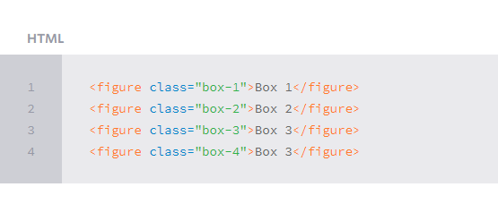
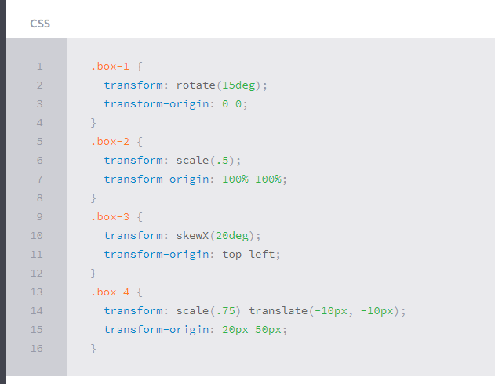
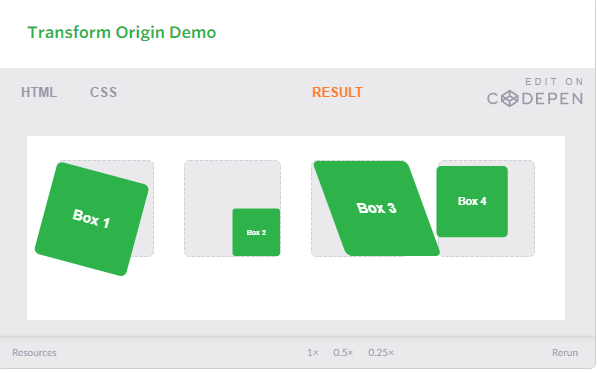

Notably, the transform-origin property does run into some issues when also using the translate transform value. Since both of them are attempting to position the element, their values can collide. Use the two of these with caution, always checking to make sure the desired outcome is achieved.

## CSS Transitions & Animations

One evolution with CSS3 was the ability to write behaviors for transitions and animations. Front end developers have been asking for the ability to design these interactions within HTML and CSS, without the use of JavaScript or Flash, for years. Now their wish has come true.

With CSS3 transitions you have the potential to alter the appearance and behavior of an element whenever a state change occurs, such as when it is hovered over, focused on, active, or targeted.

Animations within CSS3 allow the appearance and behavior of an element to be altered in multiple keyframes. Transitions provide a change from one state to another, while animations can set multiple points of transition upon different keyframes.

## Transitions

As mentioned, for a transition to take place, an element must have a change in state, and different styles must be identified for each state. The easiest way for determining styles for different states is by using the :hover, :focus, :active, and :target pseudo-classes.

There are four transition related properties in total, including transition-property, transition-duration, transition-timing-function, and transition-delay. Not all of these are required to build a transition, with the first three are the most popular.

In the example below the box will change its background color over the course of 1 second in a linear fashion.

    .box {
    background: #2db34a;
    transition-property: background;
    transition-duration: 1s;
    transition-timing-function: linear;
    }
    .box:hover {
    background: #ff7b29;
    }

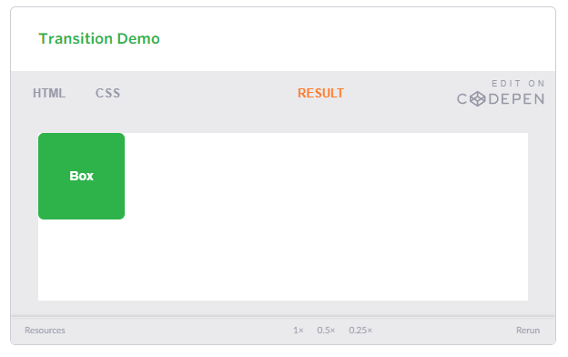

## Transition Timing

The transition-timing-function property is used to set the speed in which a transition will move. Knowing the duration from the transition-duration property a transition can have multiple speeds within a single duration. A few of the more popular keyword values for the transition-timing-function property include linear, ease-in, ease-out, and ease-in-out.

The linear keyword value identifies a transition moving in a constant speed from one state to another. The ease-in value identifies a transition that starts slowly and speeds up throughout the transition, while the ease-out value identifies a transition that starts quickly and slows down throughout the transition. The ease-in-out value identifies a transition that starts slowly, speeds up in the middle, then slows down again before ending.

Each timing function has a cubic-bezier curve behind it, which can be specifically set using the cubic-bezier(x1, y1, x2, y2) value. Additional values include step-start, step-stop, and a uniquely identified steps(number_of_steps, direction) value.

When transitioning multiple properties, you can identify multiple timing functions. These timing function values, as with other transition property values, may be declared as comma separated values.

    .box {
    background: #2db34a;
    border-radius: 6px;
    transition-property: background, border-radius;
    transition-duration: .2s, 1s;
    transition-timing-function: linear, ease-in;
    }
    .box:hover {
    background: #ff7b29;
    border-radius: 50%;
    }

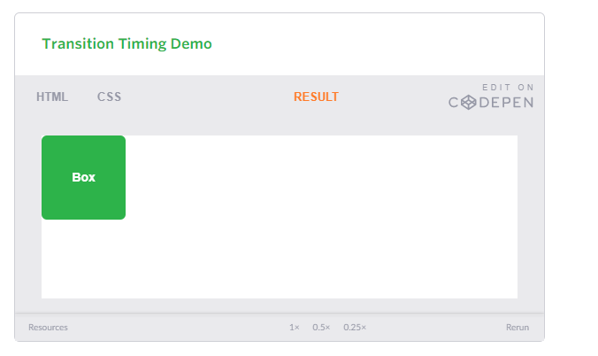
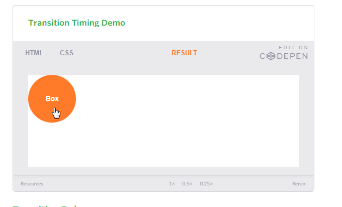

## 8 SIMPLE CSS3 TRANSITIONS THAT WILL WOW YOUR USERS

CSS3 has introduced countless possibilities for UX designers, and the best thing about them is that the coolest parts are really simple to implement.

Just a couple of lines of code will give you an awesome transition effect that will excite your users, increase engagement and ultimately, when used well, increase your conversions. What’s more, these effects are hardware accelerated, and a progressive enhancement that you can use right now.

Here are 8 really simple effects that will add life to your UI and smiles to your users’ faces.

All of these effects (bar one) are controlled with the transition property. So we can see these effects working, we’ll set up a div in an HTML page:

    <!DOCTYPE html>
    <html>
    <head>
        
    </head>
    <body>
        

    </body>
    </html>

Having done so, set its width and height (so it has dimensions), its background color (so we can see it) and its transition property.

    

## Grow & Shrink

To grow an element, you used to have to use its width and height, or its padding. But now we can use CSS3’s transform to enlarge.

Set your div’s class to “grow” and then add this code to your style block:

    .grow:hover
    {
        -webkit-transform: scale(1.3);
        -ms-transform: scale(1.3);
        transform: scale(1.3);
    }

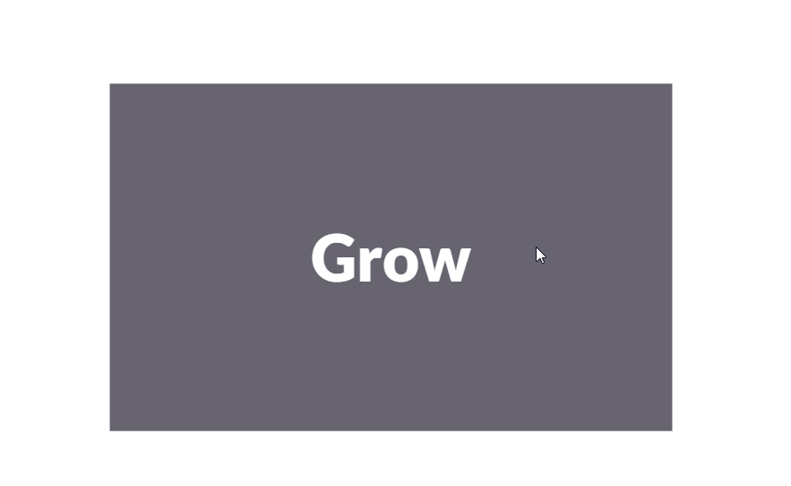

- Shrinking an element is as simple as growing it. To enlarge an element we specify a value greater than 1, to shrink it, we specify a value less than 1:

    .shrink:hover
    {
        -webkit-transform: scale(0.8);
        -ms-transform: scale(0.8);
        transform: scale(0.8);
    }

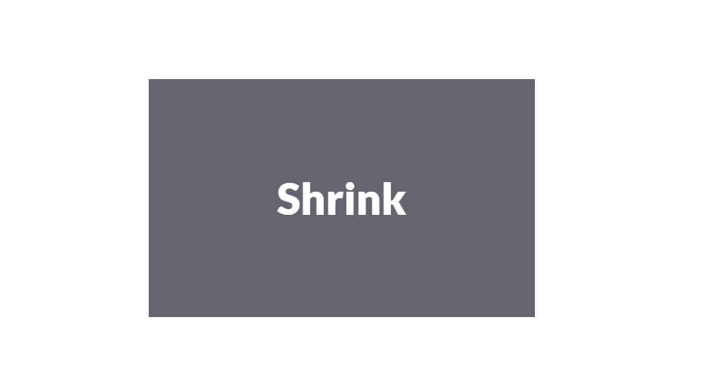
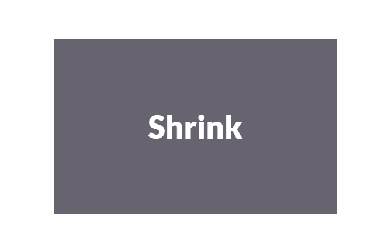

**References:**

- What Google Learned From Its Quest to Build the Perfect Team [Read the full article here](https://www.nytimes.com/2016/02/28/magazine/what-google-learned-from-its-quest-to-build-the-perfect-team.html/)

- CSS Transforms [Read the full article here](https://learn.shayhowe.com/advanced-html-css/css-transforms/)

- CSS Transitions & Animations [Read the full article here](https://learn.shayhowe.com/advanced-html-css/transitions-animations/)

- 8 Simple CSS3 Transitions That Will Wow Your Users [Read the full article here](https://www.webdesignerdepot.com/2014/05/8-simple-css3-transitions-that-will-wow-your-users)

- 6 Buttons Animated [Read the full article here](https://codepen.io/retyui/pen/ByoaXV)

- CSS3 Keyframe Animation [Read the full article here](https://codepen.io/akshaychauhan/pen/oAfae)

- 404 [Read the full article here](https://codepen.io/kieranfivestars/pen/MYdQxX)

- Pure CSS Bounce Animation [Read the full article here](https://codepen.io/dp_lewis/pen/gCfBv)

## [Main page](https://amjadmesmar.github.io/reading-notes/)