# Responsive Web Design

These days it is hard to find someone who doesn’t own a mobile device, or multiple, connected to the Internet. In the UK there are more mobile phones than people, and should trends continue mobile Internet usage will surpass that of desktop Internet usage within the year.

With the growth in mobile Internet usage comes the question of how to build websites suitable for all users. The industry response to this question has become responsive web design, also known as RWD.

- Responsive web design is the practice of building a website suitable to work on every device and every screen size, no matter how large or small, mobile or desktop. Responsive web design is focused around providing an intuitive and gratifying experience for everyone. Desktop computer and cell phone users alike all benefit from responsive websites.

- **Relative Viewport Lengths**

CSS3 introduced some new relative length units, specifically related to the viewport size of the browser or device. These new units include vw, vh, vmin, and vmax. Overall support for these new units isn’t great, but it is growing. In time they look to play a large roll in building responsive websites.

- vw
Viewports width.

- vh
Viewports height.

- vmin
Minimum of the viewport’s height and widt.

- vmax
Maximum of the viewport’s height and width.

- **Initializing Media Queries**

There are a couple different ways to use media queries, using the ***@media*** rule inside of an existing style sheet, importing a new style sheet using the ***@import*** rule, or by linking to a separate style sheet from within the HTML document. Generally speaking it is recommend to use the ***@media*** rule inside of an existing style sheet to avoid any additional HTTP requests.

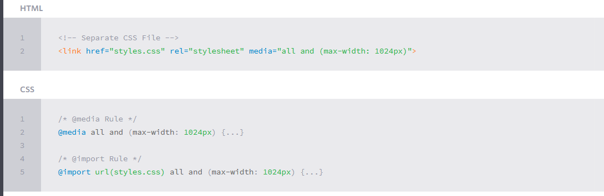

## All About Floats

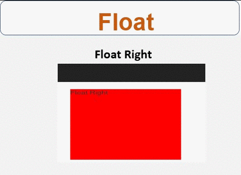

- What is “Float”?

Float is a CSS positioning property. To understand its purpose and origin, we can look to print design. In a print layout, images may be set into the page such that text wraps around them as needed. This is commonly and appropriately called “text wrap”.

In page layout programs, the boxes that hold the text can be told to honor the text wrap, or to ignore it. Ignoring the text wrap will allow the words to flow right over the image like it wasn’t even there. This is the difference between that image being part of the flow of the page (or not). Web design is very similar.

- What are floats used for?

Aside from the simple example of wrapping text around images, floats can be used to create entire web layouts.

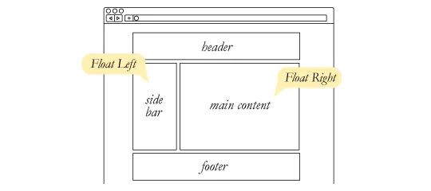

Floats are also helpful for layout in smaller instances. Take for example this little area of a web page. If we use float for our little avatar image, when that image changes size the text in the box will reflow to accommodate:

- **Problems with Floats**

Floats often get beat on for being fragile. The majority of this fragility comes from IE 6 and the slew of float-related bugs it has. As more and more designers are dropping support for IE 6, you may not care, but for the folks that do care here is a quick rundown.

1. ***Pushdown*** is a symptom of an element inside a floated item being wider than the float itself (typically an image). Most browsers will render the image outside the float, but not have the part sticking out affect other layout. IE will expand the float to contain the image, often drastically affecting layout. A common example is an image sticking out of the main content push the sidebar down below.
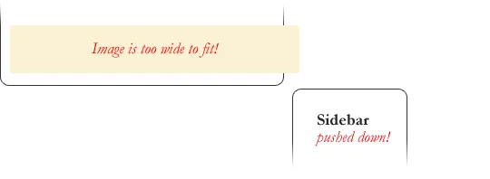
2. ***Double Margin Bug*** – Another thing to remember when dealing with IE 6 is that if you apply a margin in the same direction as the float, it will double the margin. Quick fix: set display: inline on the float, and don’t worry it will remain a block-level element.

3. The ***3px Jog*** is when text that is up next to a floated element is mysteriously kicked away by 3px like a weird forcefield around the float. Quick fix: set a width or height on the affected text.

4. In IE 7, ***the Bottom Margin Bug*** is when if a floated parent has floated children inside it, bottom margin on those children is ignored by the parent. Quick fix: using bottom padding on the parent instead.

## Don’t Overthink It Grids

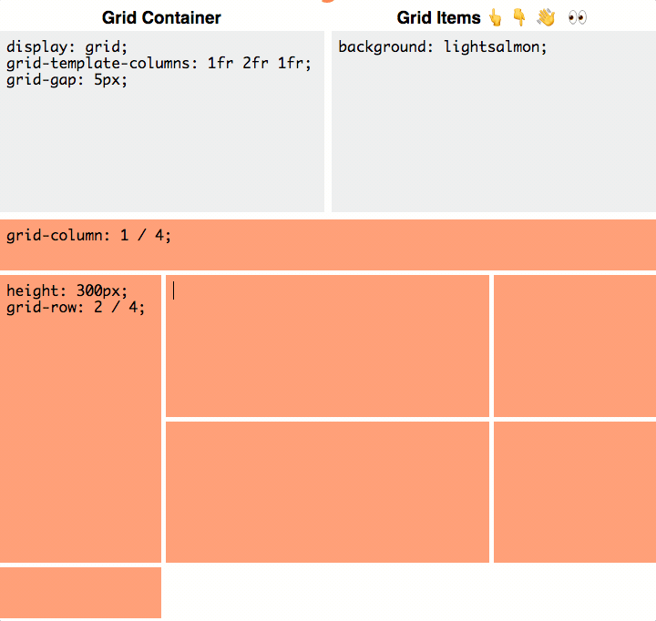

The vast majority of websites out there use a grid. They may not explicitly have a grid system in place, but if they have a “main content area” floated to the left a “sidebar” floated to the right, it’s a simple grid.

If a more complex layout presents itself, people often reach for a grid framework. They assume grids are these super difficult things best left to super CSS nerds. That idea is perpetuated by the fact that a lot of the grid systems they reach for are very complicated.

- Context

A block level element is as wide as the parent it’s inside (***width: auto;***). We can think of it as 100% wide. The wrapper for a grid probably don’t have much to do with semantics, it’s just a generic wrapper, so a ***div*** is fine.

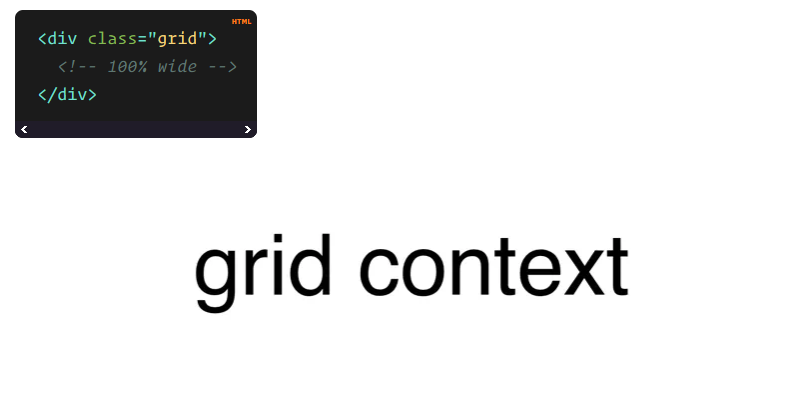

- Gutters

The hardest part about grids is gutters. So far we’ve made our grid flexible by using percentages for widths. We could make the math all complicated and use percentages for gutters as well, but personally I don’t like percentage gutters anyway, I like fixed pixel size gutters. Plus, we’re trying to keep too much thinking out of this.

The first step toward this is using box-sizing: border-box;. I like using it on absolutely everything.

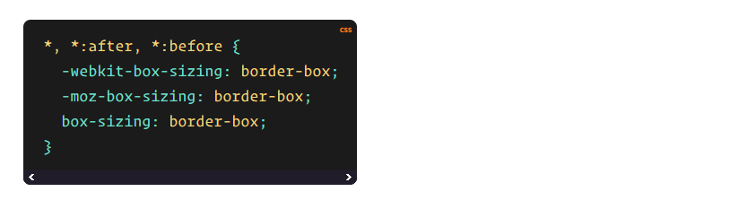

Now when we set a width, that element stays that width, despite padding or borders being applied.

The second step is applying a fixed padding to the right side of all columns except the last one.

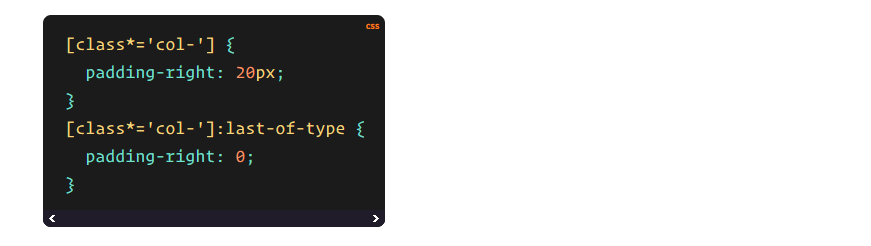
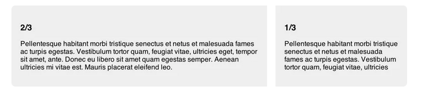

That’s all there is to basic gutters.

## CSS Floats Explained By Riding An Escalator

- Floats create alternate flows. This is the hardest part to understand. And once you introduce them, you then need to write your code so that it accounts for up to three flows: normal, left and right. This is a whole new set of rules, as opposed to manipulating the width of elements or their positioning.

Actually, floats are pretty similar to the dynamics of riding an escalator, and I am going to show how they can be used alongside the clear property to create crystal-clear relationships within divs. This way, the next time you try to use floats in your code, you won’t encounter any surprises.

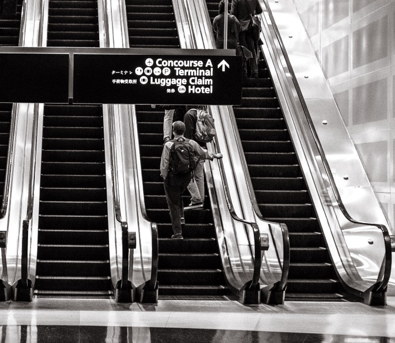

- **Floats: Left and Right**

Using floats can introduce up to two new flows: left and right.

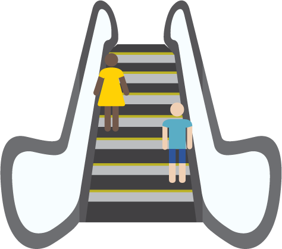

And this allows the normal flow of elements, those without a float value, to fill in the spaces around these elements.

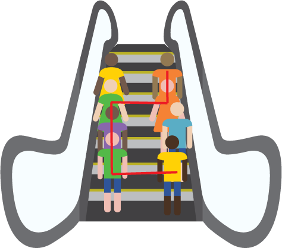

- Floats allow you to create these new relationships between flows.

If you had one line of people standing in the middle of the elevator, you would have limited options for new structures. But when you have a left and right column, suddenly you can specify that certain people stand on the right, other ones stay left, and another group can fill in the gaps.

This allows you to create more readable and understandable code, because the float property also gives an indication of an element’s relationship to surrounding elements.

## SMACSS Official Documentation

“SMACSS is becoming one of the most useful contributions to front-end discussions in years” *

I’ve been analyzing my process (and the process of those around me) and figuring out how best to structure code for projects on a larger scale. What I've found is a process that works equally well for sites small and large.

Learn how to structure your CSS to allow for flexibility and maintainability as your project and your team grows.

tainability as your project and your team grows.

- **What is it?**

SMACSS (pronounced “smacks”) is more style guide than rigid framework. There is no library within here for you to download or install. There is no git repository for you to clone. SMACSS is a way to examine your design process and as a way to fit those rigid frameworks into a flexible thought process. It is an attempt to document a consistent approach to site development when using CSS. And really, who isn’t building a site with CSS these days?!

- **Categorizing CSS Rules**

Every project needs some organization. Throwing every new style you create onto the end of a single file would make finding things more difficult and would be very confusing for anybody else working on the project. Of course, you likely have some organization in place already. Hopefully, what you read among these pages will highlight what works with your existing process and, if I’m lucky, you will see new ways in which you can improve your process.

How do you decide whether to use ID selectors, or class selectors, or any number of selectors that are at your disposal? How do you decide which elements should get the styling magic you wish to bestow upon it? How do you make it easy to understand how your site and your styles are organized?

At the very core of SMACSS is categorization. By categorizing CSS rules, we begin to see patterns and can define better practices around each of these patterns.

There are five types of categories:

1. Base
2. Layout
3. Module
4. State
5. Theme

We often find ourselves mixing styles across each of these categories. If we are more aware of what we are trying to style, we can avoid the complexity that comes from intertwining these rules.

Each category has certain guidelines that apply to it. This somewhat succinct separation allows us to ask ourselves questions during the development process. How are we going to code things and why are we going to code them that way?

Much of the purpose of categorizing things is to codify patterns—things that repeat themselves within our design. Repetition results in less code, easier maintenance, and greater consistency in the user experience. These are all wins. Exceptions to the rule can be advantageous but they should be justified.

**Base rules** are the defaults. They are almost exclusively single element selectors but it could include attribute selectors, pseudo-class selectors, child selectors or sibling selectors. Essentially, a base style says that wherever this element is on the page, it should look like this.

**Layout rules** divide the page into sections. Layouts hold one or more modules together.

**Modules** are the reusable, modular parts of our design. They are the callouts, the sidebar sections, the product lists and so on.

**State rules** are ways to describe how our modules or layouts will look when in a particular state. Is it hidden or expanded? Is it active or inactive? They are about describing how a module or layout looks on screens that are smaller or bigger. They are also about describing how a module might look in different views like the home page or the inside page.

Finally, **Theme rules** are similar to state rules in that they describe how modules or layouts might look. Most sites don’t require a layer of theming but it is good to be aware of it.

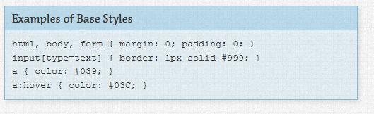

**References:**

- Shay Howe’s intro to RWD [Read the full article here](https://learn.shayhowe.com/advanced-html-css/responsive-web-design/)

- All About Floats [Read the full article here](https://css-tricks.com/all-about-floats/)

- Don’t Overthink It Grids [Read the full article here](https://css-tricks.com/dont-overthink-it-grids/)

- CSS Floats Explained By Riding An Escalator [Read the full article here](https://css-tricks.com/dont-overthink-it-grids/)

- SMACSS Official Documentation [Read the full article here](http://smacss.com/)

## [Main page](https://amjadmesmar.github.io/reading-notes/)
