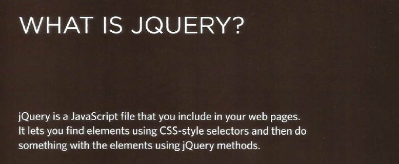
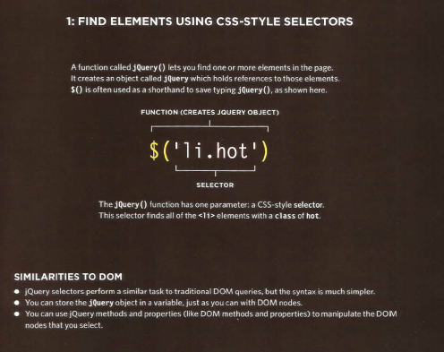
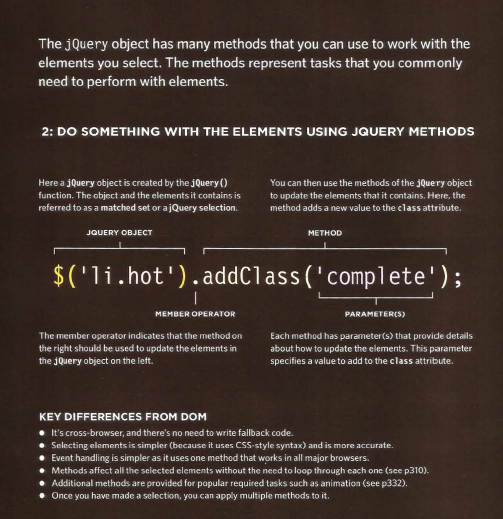
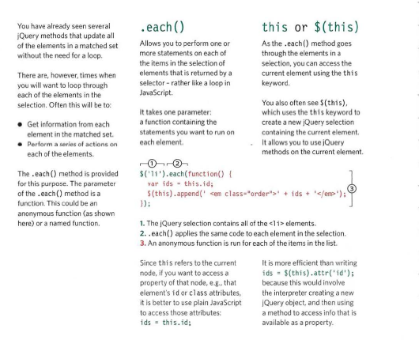
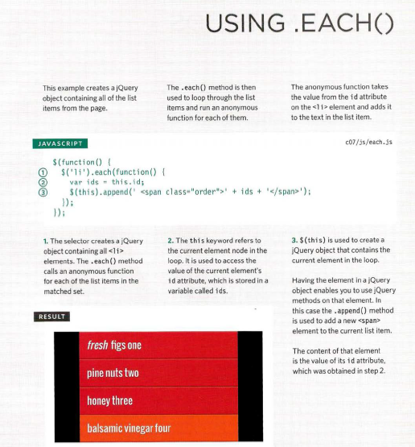
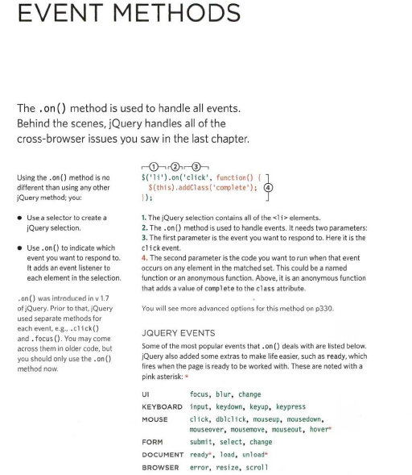
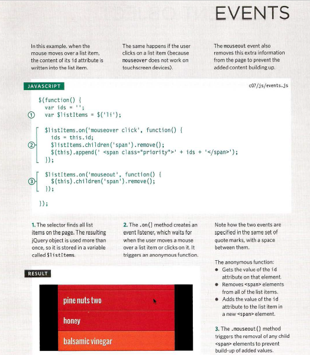
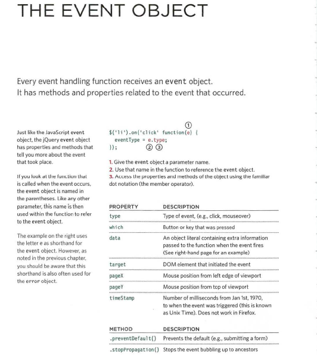
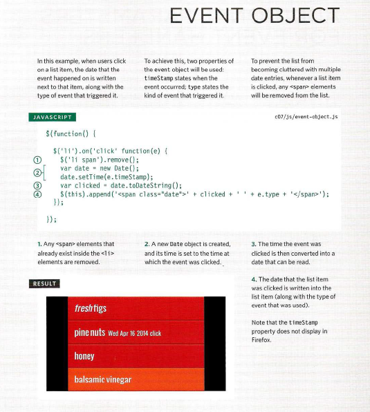

# JavaScript

## JQUERY

## WORKING WITH EACH ELEMENT IN A SELECTION

jQuery allows you to recreate the functionality of a loop on a selection of elements, using the **.each ()** method.

**References:**

- JavaScript and JQuery: Interactive Front-End Web Development
by Jon Duckett [Get the book](https://www.amazon.com/JavaScript-JQuery-Interactive-Front-End-Development/dp/1118531647)

## [Main page](https://amjadmesmar.github.io/reading-notes/)
