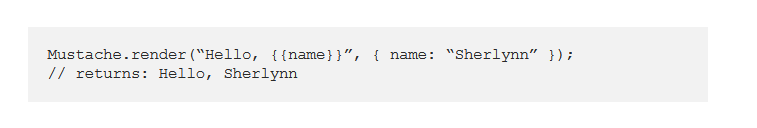

# Templating with Mustache

- **Javascript Templating**

Javascript templating is a fast and efficient technique to render client-side view templates with Javascript by using a JSON data source. The template is HTML markup, with added templating tags that will either insert variables or run programming logic.

The template engine then replaces variables and instances declared in a template file with actual values at runtime, and convert the template into an HTML file sent to the client.

Mustache is a logic-less template syntax. It can be used for HTML, config files, source code — anything. It works by expanding tags in a template using values provided in a hash or object.

It is often referred to as “logic-less” because there are no if statements, else clauses, or for loops. Instead, there are only tags. Some tags are replaced with a value, some nothing, and others a series of values.

mustache.js is an implementation of the mustache template system in JavaScript. It is often considered the base for JavaScript templating. And, since mustache supports various languages, we don’t need a separate templating system on the server side.

In the above, we see two braces around {{ name }}. This is Mustache syntax to show that it is a placeholder. When Mustache compiles this, it will look for the ‘name’ property in the object we pass in, and replace {{ name }} with the actual value, e,g, “Sherlynn”.

A confusion that I have initially was that Mustache is a templating engine. However, after some googling, I’ve come to learn that Mustache is NOT a templating engine. Mustache is a specification for a templating language. In general, we would write templates according to the Mustache specification, and it can then be compiled by a templating engine to be rendered to create an output.

## A Guide to Flexbox

- **Background**

- The Flexbox Layout (Flexible Box) module (a W3C Candidate Recommendation as of October 2017) aims at providing a more efficient way to lay out, align and distribute space among items in a container, even when their size is unknown and/or dynamic (thus the word “flex”).

The main idea behind the flex layout is to give the container the ability to alter its items’ width/height (and order) to best fill the available space (mostly to accommodate to all kind of display devices and screen sizes). A flex container expands items to fill available free space or shrinks them to prevent overflow.

Most importantly, the flexbox layout is direction-agnostic as opposed to the regular layouts (block which is vertically-based and inline which is horizontally-based). While those work well for pages, they lack flexibility (no pun intended) to support large or complex applications (especially when it comes to orientation changing, resizing, stretching, shrinking, etc.).

- ***Note***: Flexbox layout is most appropriate to the components of an application, and small-scale layouts, while the Grid layout is intended for larger scale layouts.

- **Flexbox properties**

- By default, flex items are laid out in the source order. However, the order property controls the order in which they appear in the flex container.

       .item {
       order: 5; /* default is 0 */
       }

This defines the default behavior for how flex items are laid out along the cross axis on the current line. Think of it as the justify-content version for the cross-axis (perpendicular to the main-axis).

    .container {
    align-items: stretch | flex-start | flex-end | center | baseline | first baseline | last baseline | start | end | self-start | self-end + ... safe | unsafe;
    }

- stretch (default): stretch to fill the container (still respect min-width/max-width).

- flex-start / start / self-start: items are placed at the start of the cross axis. The difference between these is subtle, and is about respecting the flex-direction rules or the writing-mode rules.

- flex-end / end / self-end: items are placed at the end of the cross axis. The difference again is subtle and is about respecting flex-direction rules vs. writing-mode rules.

- center: items are centered in the cross-axis.

- baseline: items are aligned such as their baselines align.

The safe and unsafe modifier keywords can be used in conjunction with all the rest of these keywords (although note browser support), and deal with helping you prevent aligning elements such that the content becomes inaccessible.

## Mustache.js Official Documentation

mustache.js is a zero-dependency implementation of the mustache template system in JavaScript.

Mustache is a logic-less template syntax. It can be used for HTML, config files, source code - anything. It works by expanding tags in a template using values provided in a hash or object.

We call it "logic-less" because there are no if statements, else clauses, or for loops. Instead there are only tags. Some tags are replaced with a value, some nothing, and others a series of values.

- **Where to use mustache.js?**

You can use mustache.js to render mustache templates anywhere you can use JavaScript. This includes web browsers, server-side environments such as Node.js, and CouchDB views.

mustache.js ships with support for the CommonJS module API, the Asynchronous Module Definition API (AMD) and ECMAScript modules.

In addition to being a package to be used programmatically, you can use it as a command line tool.

- **Install**
You can get Mustache via npm.

       $ npm install mustache --save

- **Usage**

Below is a quick example how to use mustache.js:

        var view = {
        title: "Joe",
        calc: function () {
        return 2 + 4;
        }
        };

        var output = Mustache.render("{{title}} spends {{calc}}", view);

In this example, the Mustache.render function takes two parameters: 1) the mustache template and 2) a view object that contains the data and code needed to render the template.

**References:**

- Templating with Mustache [Read the full article here](https://1sherlynn.medium.com/javascript-templating-language-and-engine-mustache-js-with-node-and-express-f4c2530e73b2)

- A Guide to Flexbox [Read the full article here](https://css-tricks.com/snippets/css/a-guide-to-flexbox/)

- Flexbox Froggy [Check it out](https://flexboxfroggy.com/)

- Mustache.js Official Documentation [Check it out](https://github.com/janl/mustache.js)

## [Main page](https://amjadmesmar.github.io/reading-notes/)
