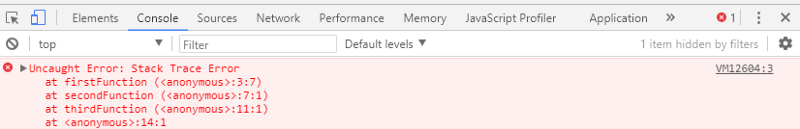
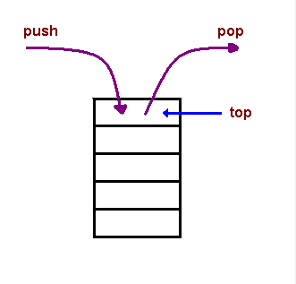

# Call stack

A call stack is a mechanism for an interpreter (like the JavaScript interpreter in a web browser) to keep track of its place in a script that calls multiple functions — what function is currently being run and what functions are called from within that function, etc.

1. When a script calls a function, the interpreter adds it to the call stack and then starts carrying out the function.

2. Any functions that are called by that function are added to the call stack further up, and run where their calls are reached.

3. When the current function is finished, the interpreter takes it off the stack and resumes execution where it left off in the last code listing.

4. If the stack takes up more space than it had assigned to it, it results in a "stack overflow" error.

- Example

        function greeting() {
        // [1] Some code here
        sayHi();
        // [2] Some code here
        }
        function sayHi() {
           return "Hi!";
        }

        // Invoke the `greeting` function
        greeting();

        // [3] Some code here

The code above would be executed like this:

1. Ignore all functions, until it reaches the greeting() function invocation.
2. Add the greeting() function to the call stack list.

        Call stack list:
        - greeting

3. Execute all lines of code inside the greeting() function.
4. Get to the sayHi() function invocation.
6. Add the sayHi() function to the call stack list.

        Call stack list:
        - sayHi
        - greeting

6. Execute all lines of code inside the sayHi() function, until reaches its end.
7. Return execution to the line that invoked sayHi() and continue executing the rest of the greeting() function.
8. Delete the sayHi() function from our call stack list.

        Call stack list:
        - greeting

9. When everything inside the greeting() function has been executed, return to its invoking line to continue executing the rest of the JS code.
10. Delete the greeting() function from the call stack list.

        Call stack list:
        EMPTY

- In summary, then, we start with an empty Call Stack. Whenever we invoke a function, it is automatically added to the Call Stack. Once the function has executed all of its code, it is automatically removed from the Call Stack. Ultimately, the Stack is empty again.

## The JavaScript Call Stack - What It Is and Why It's Necessary

- The JavaScript engine (which is found in a hosting environment like the browser), is a single-threaded interpreter comprising of a heap and a single call stack. The browser provides web APIs like the DOM, AJAX, and Timers.

- The call stack is primarily used for function invocation (call). Since the call stack is single, function(s) execution, is done, one at a time, from top to bottom. It means the call stack is synchronous.

- ***LIFO***: When we say that the call stack, operates by the data structure principle of Last In, First Out, it means that the last function that gets pushed into the stack is the first to be pop out, when the function returns.

Let us take a look at a code sample to demonstrate LIFO by printing a stack trace error to the console.

        function firstFunction(){
        throw new Error('Stack Trace Error');
        }

        function secondFunction(){
      firstFunction();
      }

     function thirdFunction(){
     secondFunction();
      }

     thirdFunction();

- When the code is run, we get an error. A stack is printed showing how the functions are stack on top each other. Take a look at the diagram.

- You will notice that the arrangement of the functions as a stack begins with the firstFunction() (which is the last function that got into the stack, and is popped out to throw the error), followed by the secondFunction(), and then the thirdFunction() (which is the first function that gets pushed into the stack when the code is executed).

- Temporarily store: When a function is invoked (called), the function, its parameters, and variables are pushed into the call stack to form a stack frame. This stack frame is a memory location in the stack. The memory is cleared when the function returns as it is pop out of the stack.

- Manage function invocation (call): The call stack maintains a record of the position of each stack frame. It knows the next function to be executed (and will remove it after execution). This is what makes code execution in JavaScript synchronous.

- Think of yourself standing on a queue, in a grocery store cash point. You can only be attended to after the person in front of you have been attended to. That’s synchronous.

This is what we mean by “manage function invocation”.

## JavaScript error messages && debugging

- Types of error messages

The first thing that indicates you that something is wrong with your code is the (in)famous error message that the one we saw just moments ago, it usually appears on your console (being developer tools of the browser, terminal or whatever else you are using).

For those already used to programming, reading an error message is like second nature, for everybody else, is something you learn either you like it or not so might as well talk a bit about each of them.

- Reference errors

This is as simple as when you try to use a variable that is not yet declared you get this type os errors.

        console.log(foo) // Uncaught ReferenceError: foo is not defined

This is also a common thing when using const and let, they are hoisted like var and function but there is a time between the hoisting and being declared so when you try to access them a reference error occurs, the fact that this happens to let and const is called Temporal Dead Zone (TDZ).

        foo = 'Hello' // Uncaught ReferenceError: foo is not defined
        let foo

- Whatever you are using (var, let or const) the fix is as simple has declaring the variable before any declaration is made.

        let foo;
        foo = 'Hello'

- Type errors

Like the name indicates, this types of errors show up when the types (number, string and so on) you are trying to use or access are incompatible, like accessing a property in an undefined type of variable.

        var foo = {}
        foo.bar // undefined
        foo.bar.baz // Uncaught TypeError: Cannot read property 'baz' of undefined

- This is probably the most frequent error in JS, trying to access a property/method thinking that bar is of the type object when in reality, since it hasn’t been declared yet, it’s undefined which doesn’t have any baz available.

- The fix is simple, just make sure that bar exists before trying to access it, either by creating bar or by checking for undefined.

        var foo = { bar: {} }
        foo.bar.baz // undefined but you avoid the error

        or

        var foo = {}
        if (typeof foo.bar !== 'undefined') {
          foo.bar.baz // this will never be executed while bar does not exist
        }

- There are also warnings, for instance telling you about a deprecated method, which can be found more frequently in firefox developer tools.

**References:**

- Call stack [Read the full article here](https://developer.mozilla.org/en-US/docs/Glossary/Call_stack)

- The JavaScript Call Stack - What It Is and Why It's Necessary [Read the full article here](https://www.freecodecamp.org/news/understanding-the-javascript-call-stack-861e41ae61d4/)

- JavaScript error messages && debugging [Read the full article here](https://codeburst.io/javascript-error-messages-debugging-d23f84f0ae7c)

- JavaScript error reference [Read the full article here](https://developer.mozilla.org/en-US/docs/Web/JavaScript/Reference/Errors)

## [Main page](https://amjadmesmar.github.io/reading-notes/)