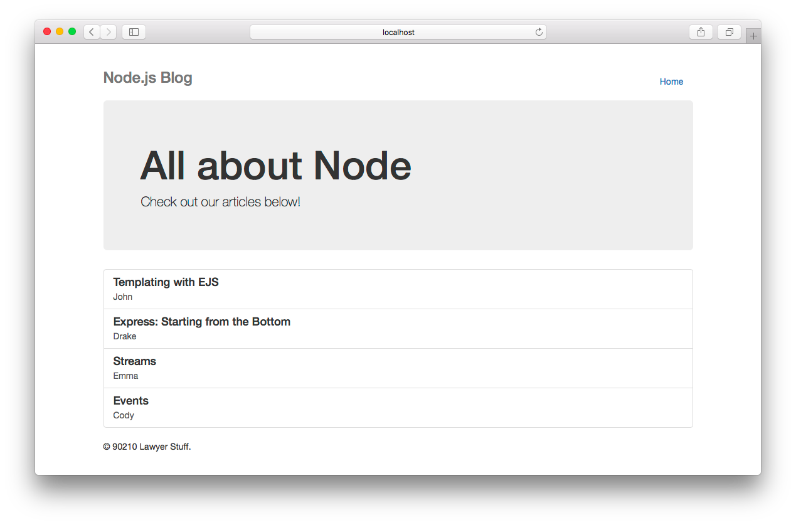
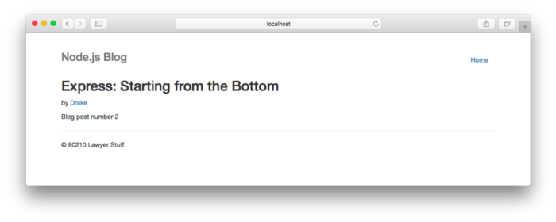

# EJS Partials

Partials come in handy when you want to reuse the same HTML across multiple views. Think of partials as functions, they make large websites easier to maintain as you don’t have to go and change a piece of text in every page it appears in. Instead, you define that reusable bundle of code in a file andinclude it wherever you need it.

- Our blog will consist of a home page which lists all the blog posts and a post page which will display a single post. Our home page will look like so:

and the post page:

- As you can see from the screenshots above, the same navigation bar and footer appear in both the home and post view. This makes them perfect candidates for partials!

- Let’s go ahead and create those partials. Under the views/partials/ directory create a file callednavbar.ejs which will contain only the HTML for the navigation bar at the top of the home and post pages:

        <!-- views/partials/navbar.ejs -->
            

            <nav>
            <ul class="nav nav-pills pull-right">
                <li role="presentation"><a href="/">Home</a></li>
            </ul>
            <h3 class="text-muted">Node.js Blog</h3>
            </nav>
        

and a file called footer.ejs in that same directory:

        <!-- views/partials/footer.ejs -->
            <footer class="footer">
            
© 90210 Lawyer Stuff.

            </footer>

- As you can see creating and including partials is very straightforward with EJS. I’ve intentionally left in some placeholders such as LIST_OF_POSTS, POST_TITLE, POST_AUTHOR, and POST_CONTENT so that we can take a look at how we can pass data from our Node + Express application to our views in the next section.

### REFERENCE

- Watch EJS tutorial from WalkThroughCode on YouTube, Video 7, Partials [Check it out](https://www.youtube.com/watch?v=3_xEEH4fTEk&list=PL7sCSgsRZ-slYARh3YJIqPGZqtGVqZRGt&index=8)

- EJS Partials [Read the full article here](https://medium.com/@henslejoseph/ejs-partials-f6f102cb7433)

## [Main page](https://amjadmesmar.github.io/reading-notes/)