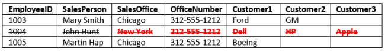

# Database Normalization (Explained in Simple English)

## Introduction to Database Normalization

Database normalization is a process used to organize a database into tables and columns.  The main idea with this is that a table should be about a specific topic and only supporting topics included. Take a spreadsheet containing the information as an example, where the data contains salespeople and customers serving several purposes:

- Identify salespeople in your organization
- List all customers your company calls upon to sell a product
- Identify which salespeople call on specific customers.

By limiting a table to one purpose you reduce the number of duplicate data contained within your database. This eliminates some issues stemming from database modifications.

To achieve these objectives, we’ll use some established rules. As you apply these rules, new tables are formed. The progression from unruly to optimized passes through several normal forms.

There are three normal forms most databases adhere to using.  As tables satisfy each successive database normalization form, they become less prone to database modification anomalies and more focused toward a sole purpose or topic. Before we move on be sure you understand the definition of a database table.

## Data Duplication and Modification Anomalies

Notice that for each SalesPerson we have listed both the SalesOffice and OfficeNumber. There are duplicate salesperson data. Duplicated information presents two problems:

1. It increases storage and decrease performance.
2. It becomes more difficult to maintain data change2.

For example:

Consider if we move the Chicago office to Evanston, IL. To properly reflect this in our table, we need to update the entries for all the SalesPersons currently in Chicago.  Our table is a small example, but you can see if it were larger, that potentially this could involve hundreds of updates.

These situations are modification anomalies. Database normalization fixes them. There are three modification anomalies that can occur:

## Insert Anomaly

- There are facts we cannot record until we know information for the entire row.  In our example we cannot record a new sales office until we also know the sales person.  Why?  Because in order to create the record, we need provide a primary key.  In our case this is the EmployeeID.

## Update Anomaly

- In this case we have the same information in several rows. For instance if the office number changes, then there are multiple updates that need to be made.  If we don’t update all rows, then inconsistencies appear.

## Deletion Anomaly

Deletion of a row causes removal of more than one set of facts.  For instance, if John Hunt retires, then deleting that row cause us to lose information about the New York office. 

### REFERENCE

- Database Normalization (Explained in Simple English) [Read the full article here](https://www.essentialsql.com/get-ready-to-learn-sql-database-normalization-explained-in-simple-english/)

## [Main page](https://amjadmesmar.github.io/reading-notes/)