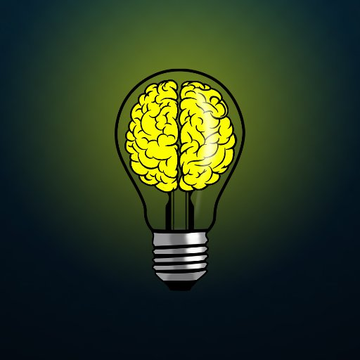

# Growth Mindset : 

**Growth Mindset** means that the person's ability can be developed with effort and facing challenges, and that talent and intellegence are just a good starting point only, It's the contrary of a **Fixed Mindset** which believes that only talent and intellegence what makes a person successful and if you didn't inhert these traits you wont develope your skills and succeed. 

- ***Challenges:***
 
 People with a **Fixed Mindset** will try to solve the problem from only one perspective and then surrender with the belief that it's impossible for them to solve it.

To have a **Growth Mindset**, you will have to take a step back, rethink your strategy and find new ways and methods to solve the issue and find a solution, meaning you have to embrace the challenge not avoiding it!

- ***Obstacles:***

To have a **Growth Mindset**, you have to avoid diverting your attention to other things other than the problem which may lead you to lose focus; Sometimes you only have to step back,take a breath and come back to the issue later when you are inspired and more focused.

-***Effort:***

To have a **Growth Mindset**, you have to put effort of you are doing, nothing will change and you wont learn a thing without doing an actual effort, no pain,no gain!

-***Criticism:***

At the end of your day always ask yourself:

1.What was the best part of the day?

2.What went wrong, and how can I make sure it doesn’t happen again?

Answering these questions will help you to put better strategies to have better days in the future,also doing this will help you process your coworkers' criticisim.

-***Success of others:***

Part of having a **Growth Mindset** is being happy for others' success and make them your source of inspiration, being jealous and hating their success will only damage you and your peers.

 By having a **Growth Mindset** you will find yourself learning faster and becoming a valuable asset in your team!
 

## [Main page](https://amjadmesmar.github.io/reading-notes/)