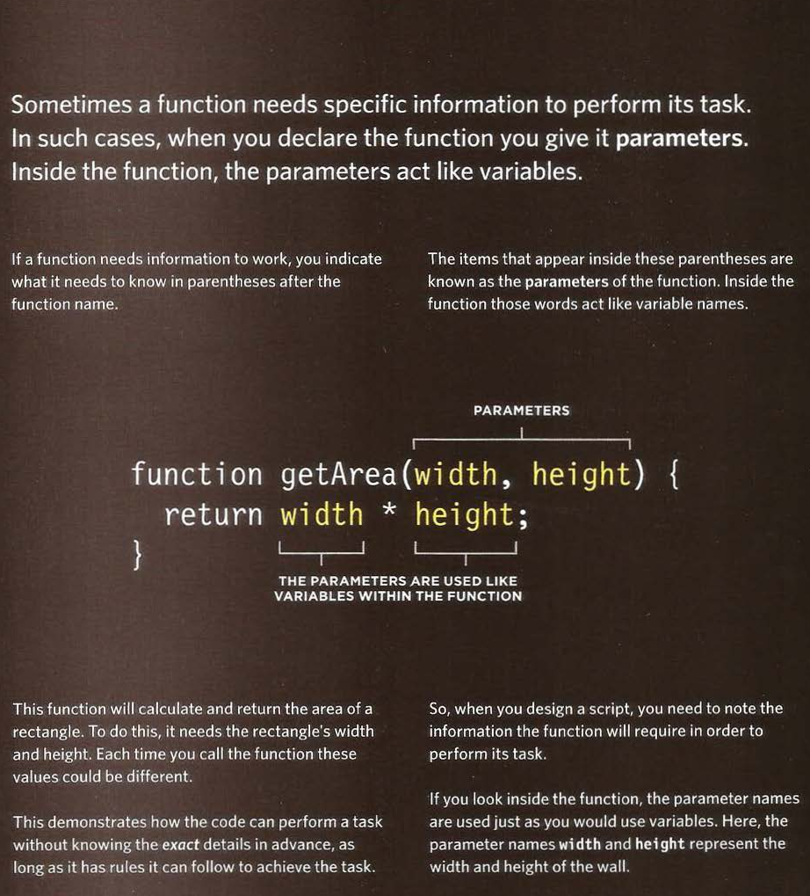

# JavaScript

## What is JavaScript?

**JavaScript** is a scripting or programming language that allows you to implement complex features on web pages, every time a web page does more than just sit there and display static information for you to look at displaying timely content updates, interactive maps, animated 2D/3D graphics, scrolling video jukeboxes, etc. you can bet that **JavaScript** is probably involved. It is the third layer of the layer cake of standard web technologies, two of which (**HTML** and **CSS**).

## Examples of JavaScript is the browser:

1. Slideshows.
2. Forms.
3. Reload part of page.
4. Filtering data.

## Scripts

- A script is a series of instructions that a
computer can follow to achieve a goal.

## Writing a script

- To write a script, you need to first
state your goal and then list the
tasks that need to be completed in
order to achieve it, start with the big picture of what
you want to achieve, and break
that down into smaller steps.

- **Define the goal:**

First, you need to define the task you want to
achieve.

- **Design the script:**

To design a script you split the goal out into a series
of tasks that are going to be involved in solving this
puzzle. This can be represented using a **flowchart**.
You can then write down individual steps that the
computer needs to perform in order to complete
each individual task (and any information it needs to
perform the task), rather like writing a recipe that it
can follow.

- **Code each step:**

- Each of the steps needs to be written in a
programming language that the computer
understands. In this case, it is **JavaScript**.
- As tempting as it can be to start coding straight
away, it pays to spend time designing your script
before you start writing it.

### ***Flowchart example:***

# Variables

## Rules for naming variables:

1. The name must begin with a letter, dollar sign ($),or an
underscore (_). It must not start
with a number.

2. The name can contain letters,
numbers, dollar sign ($), or an
underscore (_). Note that you
must not use a dash(-) or a 
period (.) in a variable name.

3. You cannot use keywords or
reserved words. Keywords
are special words that tell the
interpreter to do something. For
example, **var** is a keyword used
to declare a **variable**. Reserved
words are ones that may be used
in a future version of **JavaScript**.

4. All variables are case sensitive,
so ***score*** and **Score*** would be
different variable names, but
it is bad practice to create two 
variables that have the same
name using different cases. 

5. Use a name that describes the kind of information that the variable stores. For example, ***firstName*** might be used to store a person's first name,
***lastNarne*** for their last name,
and ***age*** for their age.

6. If your variable name is made
up of more than one word, use a
capital letter for the first letter of
every word after the first word.
For example, ***firstName*** rather
than **firstname*** (this is referred
to as camel case). You can also
use an underscore between each
word (you cannot use a dash).

## Arrays

- An array is a special type of variable. It doesn't
just store one value; it stores a list of values.

### Examples:

- The example below shows a 2 ways to create an array using **JavaScript** :

- The example below shows more actions you can do with arrays:

# EXPRESSIONS

- An expression evaluates into (results in) a single value. Broadly speaking
there are two types of expressions.

1. Expressions that just assign a value to a variable.

**Example:**

     var color = 'beige';

- The value of co1or is now beige.

2. Expressions that use two or more values to return a single value.

**Example:**

     var area = 3 * 2;

- The value of area is now 6.

# Operators

- **Expressions** rely on things called **operators**; they allow programmers to
create a single value from one or more values.

## **Example:**

## **Arithmetic operators example:**

# Functions

## What is a function?

- **Functions** let you group a series of statements together to perform a
specific task.

- ## **Function declaration:**

- ## **Calling a function:**

- ## **Declaring functions that needs information**

**References:**

- JavaScript and JQuery: Interactive Front-End Web Development
by Jon Duckett [Get the book](https://www.amazon.com/JavaScript-JQuery-Interactive-Front-End-Development/dp/1118531647)

## [Main page](https://amjadmesmar.github.io/reading-notes/)