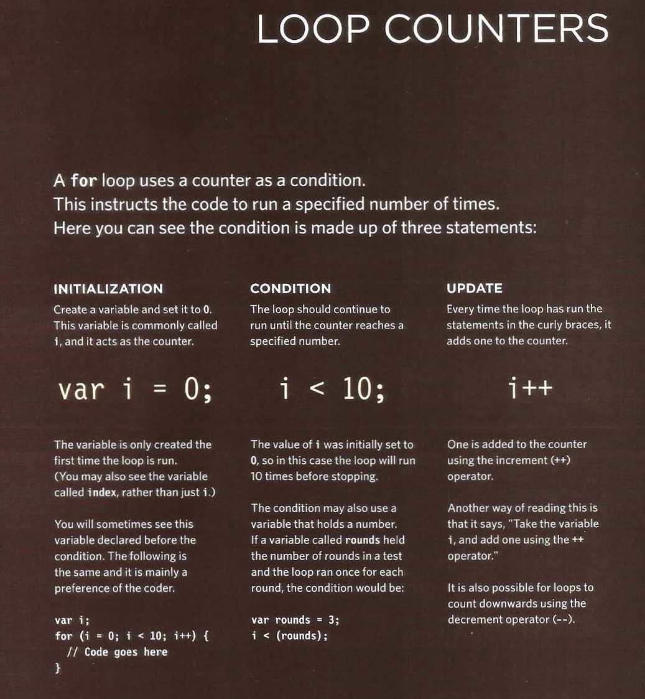
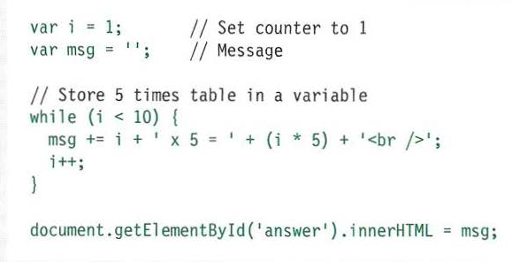

# Comparison Operators

## Evaluating Conditions:

## Using comparision operators:

### **Example:**

    var pass = 50;  // Pass mark
    var score = 90; //Score

    // Check if the user has passed
    var hasPassed = score > = pass ;

    // Write the message into the page
    var el = document.getElementByl('answer');
    e1.textContent = 'Leve 1 passed: ' + hasPassed;

# Loops :

- **Loops** check a condition. If it returns **true**,a code block will run.
Then the condition will be checked again and if it still returns **true**, the code block will run again. it repeats until the condition returns **false**.

- There are 3 common tyoes of loops :

## Loop counters and For Loops:

## Using While loops:

### **Example:**

## Using Do While loops:

### **Example:**

**References:**

- JavaScript and JQuery: Interactive Front-End Web Development
by Jon Duckett [Get the book](https://www.amazon.com/JavaScript-JQuery-Interactive-Front-End-Development/dp/1118531647)

## [Main page](https://amjadmesmar.github.io/reading-notes/)